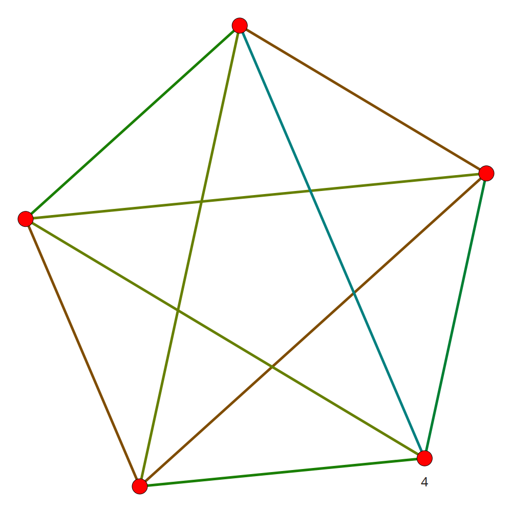

##################
Graphenoperationen
##################

Einleitung
==========

:dropcaps:`Eine` grobe Übersicht über die einzelnen Graphenoperationen und ihrer
Zuständigkeiten wurde bereits in der Projektarbeit gegeben. Im Folgenden  
wird detailliert auf ihre Funktionsweise und Internas eingegangen.

``rebuild:`` Aufbau des Graphen
-------------------------------

Bevor irgendeine andere Operation ausgeführt werden kann, muss mittels der
``rebuild``--Operation der Graph aufgebaut werden. Wie bereits in der
Projektarbeit erwähnt, kann der Graph aufgrund von einer Komplexität von
:math:`O(n^2)` nicht einfach durch das Vergleichen aller Songs untereinander
erfolgen. Daher muss eine Lösung mit subquadratischen Aufwand gefunden werden.
Vorzugsweise eine, bei der der Rechenaufwand gegen die Qualität der
Approximation abgewägt werden kann.  So kann der Nutzer entscheiden, wie lange
er *libmunin* rechnen lassen will.

Der Ausgangszustand der ``rebuild``--Operationen, ist eine Liste von Songs die
vom Nutzer bereitgestellt wird. Jeder Song darin soll nun so im Graphen
platziert werden, dass er im Bestfall die ähnlichsten Songs als Nachbarn hat. 

Jeder Song speichert seine Nachbarn mit der dazugehörigen Distanz.  Soll ein
neuer Nachbar hinzugefügt werden, so wird geprüft ob die Distanz zu diesem neuen
Song besser ist, als die zum schlechtesten vorhandenen Nachbar.  Ist dies der
Fall, so wird die Entfernung zu diesem schlechtesten Nachbarn *in eine Richtung*
(die Gründe hierfür werden unter :ref:`ref_distance_add` betrachtet) gekappt.
Als Ersatz wird zu dem neuen, besseren Song, eine bidirektionale Verbindung
aufgebaut. Da die Verbindung zum schlechtesten Song nur unidirektional abgebaut
wird, ist die Anzahl der Nachbarn eines Songs nicht auf ein Maximum begrenzt,
da das Hinzufügen neuer Songs *,,Einbahnstraßen"* hinterlässt. Jedes neue
Einfügen kann schließlich Einbahnstraßen hinterlassen.

Vielmehr handelt es sich dabei um einen Richtwert, um den sich die tatsächliche
Anzahl der Songs einpendeln wird. Momentan ist dieser Richtwert standardmäßig
auf :math:`15` gesetzt --- der durchschnittlichen Länge eines heutigen Albums
plus eins [#f1]_. Dieser Wert hat sich nach einigen Tests als passabel erwiesen.
Bei zu niedrigen Werten verbinden sich die einzelnen Songs eines Albums nur
untereinander, bei zu hohen entstehen zu viele qualitativ schlechte Verbindungen
quer über den ganzen Graphen.

Wenn im folgenden vom *,,Berechnen der Distanz"* gesprochen wird, so ist damit
auch das Hinzufügen der Distanz zwischen beiden Songs gemeint.

.. subfigstart::

.. _fig-window-sliding:

.. figure:: figs/sliding_window.*
    :alt: Schematische Darstellung des sliding_window
    :width: 100%
    :align: center
    
    Darstellung des sliding_window. 

.. _fig-window-centering:

.. figure:: figs/centering_window.*
    :alt: Schematische Darstellung des centering_window
    :width: 100%
    :align: center
    
    Darstellung des centering_window.

.. _fig-window-anti-centering:

.. figure:: figs/anti_centering_window.*
    :alt: Schematische Darstellung des anti_centering_window
    :width: 100%
    :align: center
    
    Darstellung des anti_centering_window.

.. subfigend::
    :width: 0.5
    :alt: Schematische Darstellungen der einzelnen Basisiterationen
    :label: fig-windows
 
    Schematische Darstellungen der einzelnen Basisiterationen. Es werden jeweils
    drei Iterationen in einem Bild dargestellt. Das Fenster in der ersten
    Iteration ist dabei jeweils grün, in der zweiten gelb und in der letzten rot
    dargegestellt. Die Zahlen repräsentieren einzelne Songs.

Im Folgenden werden die drei Schritte der ``rebuild``--Operation genauer
beleuchtet:

- **Basisiteration:** Für jeden Song wird nach willkürlich festgelegten
  Prinzipien eine kleine Menge von möglicherweise ähnlichen Songs ausgewählt. 
  Diese Menge von Songs wird untereinander mit quadratischen Aufwand verglichen.
  Diese Vorgehensweise wird mehrmals mit verschiedenen Methoden wiederholt. Das
  Ziel jeder dieser Iterationen, ist es für einen Song zumindest eine kleine 
  Anzahl von ähnlichen Songs zu finden. Basierend auf diesen wird in den
  nächsten Schritten versucht, die Anzahl ähnlicher Songs zu vergrößern.

  Momentan sind drei verschiedene Iterationsstrategien implementiert. Jede
  basiert auf gewissen heuristischen Annahmen, die über die Eingabemenge gemacht
  werden (siehe auch Abbildung :num:`fig-windows`):

    * ``sliding_window:`` Schiebt ein *,,Fenster"* über die Liste der Songs.
      Alle Songs innerhalb des Fensters werden untereinander verglichen.  Die
      Fenstergröße ist dabei konfigurierbar und ist standardmäßig auf 60
      eingestellt, da sich diese Größe nach einigen Tests als guter Kompromiss
      zwischen Qualität und Geschwindigkeit herausgestellt hat.  Bei jeder
      Iteration wird das Fenster um ein Drittel der Fenstergröße
      weitergeschoben.  Dadurch entsteht eine *,,Kette"* von zusammenhängenden
      Songs.

      Die heuristische Annahme ist dabei, dass der Nutzer der Bibliothek seine
      Datenbank meist nach Alben sortiert eingibt. Durch diese Sortierung finden
      sich innerhalb eines Fensters oft Lieder desselben Albums --- diese  sind 
      oft sehr ähnlich.

    * ``centering_window:`` Basiert ebenfalls auf einem Fenster. Im Gegensatz
      zum obigen ``sliding_window`` besteht das Fenster allerdings aus zwei
      Hälften, wobei die eine vom Anfang an startet und die andere Hälfte von
      der Mitte aus bis zum Ende geschoben wird. Die Songs in beiden Hälften
      werden analog zu oben untereinander verglichen. 
      Auch hier wird das Fenster immer zu einem Drittel der Fenstergröße
      weitergeschoben.

      Die heuristische Annahme ist hier, dass in der bereits vorhandenen
      *,,Kette"* Querverbindungen hergestellt werden. Dies ist im folgenden
      Verfeinerungsschritt vorteilhaft um Iterationen einzusparen.

    * ``anti_centering_window:`` Sehr ähnlich zum ``centering_window``. Statt
      die zwei Hälften von der Mitte aus bis zum Ende weiter zu schieben,
      wird diese vom Ende zur Mitte geschoben. So werden die beiden Hälften
      solange weiter geschoben, bis sie sich in der Mitte treffen. 
      Auch hier sollen weitere Querverbindungen hergestellt werden.

- **Verfeinerung:** Um den momentan sehr grob vernetzten Graphen benutzbar zu
  machen, müssen einige Iterationen zur *,,Verfeinerung"* durchgeführt werden.
  Dabei wird über jeden Song im Graphen iteriert und dessen *indirekte Nachbarn*
  (also die Nachbarn der direkten Nachbarsongs) werden mit dem aktuellen Song
  verglichen. Kommen dabei Distanzen zustande, die niedriger sind als die der
  aktuellen Nachbarn, wird der indirekte Nachbar zum direkten Nachbarn. Auf
  diese Weise nähern sich ähnliche Songs immer weiter an.
  Diese Vorgehensweise wird solange wiederholt, bis nur noch eine geringe Anzahl
  von Songs *,,bewegt"* wird oder bis eine maximale Anzahl von Iterationen
  erreicht ist. Die Begrenzung der Iterationen ist nötig, da es Fälle geben
  kann, in denen einzelne Songs immer wieder zwischen zwei gleich guten
  Zuständen hin- und herspringen können.

  Als zusätzliche Optimierung, werden nicht alle indirekten Nachbarn betrachtet,
  sondern nur diese, zu denen der Weg eine *Mindestdistanz* nicht überschreitet.
  Diese Mindestdistanz wird beim Start auf :math:`2,0` (da ja die Distanz über
  zwei Kanten gemessen wird) gesetzt und während der folgenden Iterationen immer
  weiter abgesenkt.

  Die Gesetzmäßigkeit, nach der die Mindesdistanz immer weiter abgesenkt wird,
  berechnet sich dabei aus dem arithmetischen Mittelwert, der bis dahin
  berechneten Distanzen. Ist der Mittelwert hoch, so ist die Absenkung klein.

- **Aufräumarbeiten:** Nach dem Verfeinerungsschritt, wird der Graph von
  Einbahnstraßen durch einen ``fixing``--Schritt bereinigt und auf Konsistenz
  geprüft.

Wie bereits erwähnt, gibt es eine ``rebuild_stupid``--Operation, die für
deutlich kleinere Mengen von Songs praktikabel einsetzbar ist. Die Algorithmik
ist hierbei bedeutend einfacher: Es wird einfach jeder Song mit jedem anderen
verglichen. Als Nachbarn erhält dabei jeder Song die Nachbarn, die global
betrachtet, die kleinste Distanz zu diesem besitzen. Es handelt sich also um
keine Approximation wie beim herkömmlichen ``rebuild``.

Auf die Betrachtung der Komplexität der ``rebuild``--Operation, wird an dieser
Stelle verzichtet. Keine der einzelnen Schritte erreicht dabei quadratische
Komplexität. Die einzige Ausnahme ist dabei, das Vergleichen der Songs
untereinander innerhalb eines Fensters, allerdings ist dabei  die Fenstergröße
stets auf ein verträgliches Limit begrenzt. 

Unter Abbildung :num:`fig-speed-cmp` findet sich eine Gegenüberstellung von den
Aufrufen der Distanzfunktion, die bei ``rebuild_stupid`` und beim normalen
``rebuild`` (mit und ohne *Verfeinerungsschritt*) nötig sind.

Die einzelnen Schritte des Graphenaufbaus lassen sich in Abbildung
:num:`fig-graph-linear`, sowie bei den darauf folgenden Abbildungen,
nachvollziehen. 

.. _fig-speed-cmp: 

.. figure:: figs/graph_speed.*
   :width: 100%
   :alt: Vergleich der Distanzberechnungen für rebuild_stupid und rebuild
   :align: center

   Gegenüberstellung von verschiedenen Arten der rebuild--Operation. Auf der
   Y--Achse ist logarithmisch die Anzahl der Distanzberechnungen aufgetragen,
   auf der X--Achse die lineare Anazhl der Eingabesongs. Die blaue Kurve
   repräsentiert dabei die Vergleiche die für rebuild_stupid notwendig sind.
   Wie man sieht, übersteigen diese, bis auf dem Gleichheitsbereich am Anfang,
   die anderen zwei Kurven deutlich.

``fixing:`` Umbauen von Einbahnstraßen
--------------------------------------

Diese Operation dient dem Entfernen von Einbahnstraßen innerhalb des Graphen.
Einbahnstraßen können, wie bereits erwähnt, beim Hinzufügen neuer Distanzen
entstehen. 

Beim Entfernen wird folgendermaßen vorgegangen: Im ersten Schritt werden alle
unidirektionalen Kanten gefunden und abgespeichert. Für jede dieser Kanten wird
überprüft, ob die Songs an beiden Enden, den Richtwert für die Anzahl der Nachbarn
überschreiten. Sollte das nicht der Fall sein, so wird die Kante in eine
bidirektionale Kante umgebaut. Andernfalls wird die Kante gelöscht.

Dieses Vorgehen wurde gewählt, weil es nach einigen Versuchen schwierig erschien,
den Graphen ohne Einbahnstraßen aufzubauen, ohne dass dieser zur Inselbildung
neigt. Durch den nachgelagerten ``fixing``--Schritt werden Songs, die nur wenige
Nachbarn besitzen, durch die vorher als zu schlecht bewerteten Kanten verbunden.
Als zusätzliche Konsistenzprüfung wird nach dem Bereinigen geprüft, ob alle
Verbindungen im Graphen bidirektional sind. Sollten unidirektionale Kanten
gefunden werden, so wird eine Warnung auf der Konsole ausgegeben. Eine weiterführende
Fehlerbehandlung ist momentan noch nicht implementiert. Unidirektionale Kanten
können bei der Traversierung zu Ausnahmefehlern führen.

``add:`` Hinzufügen von Songs vor dem ``rebuild``
-------------------------------------------------

Diese Operation benötigt als Argument eine Hashtabelle mit einer Abbildung von
Attributen auf Werte. Diese Werte werden dann, wie in der Projektarbeit
besprochen, durch verschiedene Provider normalisiert. Mit diesen normalisierten
Informationen, wird dann eine neue Song--Instanz erzeugt, welcher beim Erzeugen,
ein eindeutiger Identifier zugewiesen wird. Dieser Identifier dient dann als
Index in der internen Songliste. 
Statt wie ``insert``, bereits Verbindungen zu anderen Songs herzustellen, fügt
diese Operation lediglich einen Song der internen Songliste hinzu. Die
eigentlichen Verbindungen werden in einem Rutsch von ``rebuild`` aufgebaut.

.. ///////////////////////////////////

.. subfigstart::

.. _fig-mini-graph-remove-before:

.. figure:: figs/mini_graph_remove_before.png
    :width: 50%
    :align: center
    
    Vor der remove--Operation.

.. _fig-mini-graph-remove-after:

.. figure:: figs/mini_graph_remove_after.png
    :width: 50%
    :align: center
    
    Nach der remove--Operation.

.. subfigend::
    :width: 0.49
    :alt: Vor und nach der remove--Operation
    :label: fig-mini-graph-remove

    Vor (:num:`fig-mini-graph-remove-before`) und nach
    (:num:`fig-mini-graph-remove-after`) der remove--Operation. 
    Es wurde der mittlere Punkt in :num:`fig-mini-graph-remove-before` gelöscht. 
    Daher haben sicht alle anderen Knoten einen anderen Nachbarn gesucht.

.. -----------------------------------

.. subfigstart::

.. _fig-mini-graph-insert-before:

    
    Vor der insert--Operation.

.. _fig-mini-graph-insert-after:

    
    Nach der insert--Operation.

.. subfigend::
    :width: 0.49
    :alt: Vor und nach der insert--Operation
    :label: fig-mini-graph-insert

    Vor (:num:`fig-mini-graph-insert-before`) und nach
    (:num:`fig-mini-graph-insert-after`) der insert--Operation. Es wurde
    einfach ein weiterer Punkt in den Graphen eingefügt. Dieser hat sich mit
    allen anderen verbunden.

.. -----------------------------------

.. subfigstart::

.. _fig-mini-graph-modify-before:

.. figure:: figs/mini_graph_modify_before.png
    :width: 60%
    :align: center
    
    Vor der modify--Operation.

.. _fig-mini-graph-modify-after:

.. figure:: figs/mini_graph_modify_after.png
    :width: 60%
    :align: center
    
    Nach der modify--Operation.

.. subfigend::
    :width: 0.49
    :alt: Vor und nach der modify--Operation
    :label: fig-mini-graph-modify

    Vor (:num:`fig-mini-graph-modify-before`) und nach
    (:num:`fig-mini-graph-modify-after`) der modify--Operation.
    Es wurden jeweils die Mittelknoten der beiden Inseln mit einem höhren Rating
    ,,modifiziert”. Dadurch verbinden sich beide und verlieren dafür eine andere
    Verbindung jeweils.

.. ///////////////////////////////////

``remove:`` Löschen von Songs zur Laufzeit
------------------------------------------

Um nach einer ``rebuild``--Operation einen Song aus dem Graphen zu löschen,
müssen alle Verbindungen zu diesem entfernt werden.  Um dabei eine Bildung von
Inseln (durch das Entfernen von Verbindungen) zu vermeiden, werden alle
ursprünglichen Nachbarn des zu entfernenden Songs untereinander verbunden. Dabei
wird nach folgendem Schema vorgegangen: Zuerst wird temporär für jeden Nachbarn,
der Richtwert für die Anzahl der Nachbarn um eins erhöht. Im Anschluss wird die
Menge aller Nachbarn untereinander mit quadratischem Aufwand verglichen. Dadurch
bekommt jeder Nachbar, im besten Fall, eine neue Verbindung.  Abschließend
werden alle Verbindungen zum zu löschenden Song entfernt und der Richtwert wird
wieder um eins dekrementiert.

Da *libmunin* alle Songs in einer linearen Liste hält, muss auch dort der Song
gelöscht werden. Da der Index des Songs in der Liste gleich des *Identifiers*
des Songs ist, wird an dessen Stelle ein leerer Wert geschrieben. Damit dieser
möglichst bald wieder besetzt werden kann, wird der gelöschte
*Identifier--Index* in einer sogenannten *Revocation*--Liste gespeichert. Beim
nächsten ``add`` oder ``insert`` wird dieser *Identifier* dann wiederverwendet.
Dieses Verfahren soll eine Fragmentierung der Song--Liste nach vielen
``remove``--Operation vermeiden.

.. _ref-graphop-insert:

``insert:`` Hinzufügen von Songs zur Laufzeit
----------------------------------------------

Diese Operation ist äquivalent zur ``add``--Operation. Als Erweiterung fügt
``insert`` allerdings den, durch ``add`` erzeugten Song, auch in den Graphen ein
und verbindet ihn dort. Dazu muss zuerst ein Punkt gefunden werden, an dem der
Song passend zu seinen Attributen *eingepasst* werden kann.

Diese Einpassung geschieht dabei folgendermaßen:

- **Basisiteration:** Es wird mit einer gewissen *Schrittweite* über die
  Songliste iteriert. Dabei werden die Distanzen vom momentan aktuellen Song zum
  einzufügenden Song berechnet. Dadurch wird der Song bereits mit einigen
  anderen Songs verknüpft.  Die Größe der Schrittweite ist dabei abhängig von
  der Länge der Songliste.  Je länger die Liste ist, desto größer ist die
  Schrittweite.  Exakt ist sie dabei folgendermaßen definiert:

  .. math::

      Schrittweite = \lceil\log_{10}songlist\_length\rceil

- **Verfeinerung:** Songs, zu denen im vorigen Schritt eine geringe Distanz
  gefunden wurde, werden nun detaillierter betrachtet. Dazu wird die Distanz zu
  den Nachbarn dieser *guten* Songs berechnet. Dies geschieht unter der
  Annahme, dass die indirekten Nachbarn des einzufügenden Songs auch
  als potenzielle direkte Nachbarn geeignet sind.

Als zusätzliche Beobachtung lässt sich feststellen, dass Songs die per
``insert`` eingefügt werden, deutlich weitläufiger verbunden sind, als regulär
per ``add`` hinzugefügte. Diese Eigenschaft macht sich die in der Projektarbeit
gezeigte Demonanwendung zu Nutze: Ändert man das Rating eines Songs, so wird
der Song mittels ``remove`` gelöscht und mittels  ``insert`` an anderer Stelle
wieder eingefügt. Meist verbindet sich dabei der Song dann mit anderen ähnlich
bewerteten Songs. Diese bilden ein *zusätzliches Netz* über dem Graphen, welches
weitläufigere Sprünge ermöglicht.  Dadurch hat der Nutzer eine 
Möglichkeit den Graphen seinen Vorstellungen nach umzubauen (Stichwort
*explizites Lernen*).

``modify:`` Verändern der Songattribute zur Laufzeit
----------------------------------------------------

Diese Operation dient als Komfortfunktion. Sie ermöglicht das Verändern der
Attribute, beziehungsweise deren zugeordneten Werte eines einzelnen Songs.
Würde man die Werte eines Songs manuell verändern, so müsste man alle Distanzen
zu diesem Song neu berechnen. Da dies wiederum Veränderungen im ganzen Graphen
hervorrufen könnte, wurden die Song--Instanzen unveränderbar *(,,Immutable")*
gemacht. 

Die ``modify``--Operation umgeht dieses Problem, indem es den Song erst durch ein
``remove`` entfernt und eine Kopie des ursprünglichen Songs herstellt. In dieser
werden die neuen Werte gesetzt. Dieser neue, noch unverbundene Song, wird dann
mittels einer ``insert``--Operation in den Graphen eingepasst. 

Aufgrund dieser Abfolge unterschiedlicher Operation, ist ``modify`` um ein
Vielfaches aufwendiger (siehe dazu auch Tabelle :num:`table-specs`).  Es wird
empfohlen, diese Operation nur für einzelne Song jeweils einzusetzen. Sollte ein
bestimmtes Attribut in allen Songs geändert werden, so ist eher eine
``rebuild``--Operation zu empfehlen.

.. _ref_distance_add:

Ablauf beim Hinzufügen einer Distanz
------------------------------------

Wie bereits erwähnt, speichert jeder Song eine Hashtabelle mit den jeweiligen
Songs, zu denen er eine Verbindung hält, als Schlüssel und der Distanz als Wert.
Um diese Hashtabelle zu füllen, ist eine Methodik nötig, die sich nach näherer
Betrachtung als relativ schwierig zu implementieren erwies. Tatsächlich
wurden an die zwei Wochen mit unterschiedlichen Herangehensweisen verbracht.

Die Anzahl von Nachbarn pro Song sollte sich um einen gewissen *Richtwert*
einpendeln, den man konfigurieren kann. Daraus folgt, dass bei zu vielen
Nachbarn der schlechteste Nachbar entfernt werden muss. Der anfängliche
Versuch, die Verbindung zwischen den beiden Songs komplett zu löschen hatte aber
ein gewichtiges Problem: Die Inseln im Graphen, die jeweils ein Album
repräsentierten, haben sich nur untereinander verbunden. Verbindungen dazwischen
wurden immer wieder als der *schlechteste Nachbar* erkannt und entfernt. Daher
neigt der entstehende Graph stark zur Inselbildung und Bildung von starken
Clustern.

Die momentane Lösung ist dabei, dass der schlechteste Nachbar eine
unidirektionale Verbindung zu seinem ursprünglichen Partner aufrecht erhält. Die
Verbindung wird nicht bidirektional gelöscht. Der Trick ist dabei: Bei der
``rebuild``--Operation werden diese *Einbahnstraßen* immer noch von einer Seite
als Nachbarn erkannt. So kann insbesondere der *Verfeinerungsschritt* gut
zueinander passende Songs näher aneinander ziehen. Nach dem ``rebuild`` werden
übrig gebliebene Einbahnstraßen in normale Verbindungen umgebaut oder, falls
beide Enden der Verbindung bereits *,,voll"* sind, gelöscht. So bleiben Songs,
zu denen kein passender Partner gefunden wurde, mit dem Rest des Graphen
verbunden. 

Dieses Vorgehen bringt aber einige algorithmische Probleme mit sich: Das
Finden des schlechtesten Nachbarn würde jeweils linearen Aufwand zum Iterieren
über die Hashtabelle erfordern.  Zwar kann dann die schlechteste Distanz und der
dazugehörige Song zwischengespeichert werden, doch nach einigen Tests stellte
sich heraus, dass in den meisten Fällen ein neuer, schlechtester Song gesucht
werden muss. Das ist damit zu erklären, dass gegen Ende der
``rebuild``--Operation tendenziell immer niedrigere Distanzen gefunden werden
--- womit immer wieder der schlechteste Song herausgelöscht werden muss.

Der momentane Ansatz speichert pro Song, neben der Hashtabelle mit den
Distanzen, auch einen Heap als *,,Lookup--Hilfe"*.
In diesem werden, entgegen der prinzipbedingten Unordnung in einer Hastabelle, die
zuletzt hinzugefügten Paare aus Distanzen und Songs partiell sortiert abgelegt.
Gemäß der Natur eines Heaps TODO, ist dabei der Wurzelknoten, immer das Element mit
der größten Distanz.  Ist es dann nötig, eine neue, schlechteste Distanz zu
finden, so kann mit einem Aufwand von :math:`O(\log n)` das oberste Paar
herausgenommen werden.

Die ``distance_add()``--Funktion nimmt drei Parameter. Die ersten zwei sind die
Songs (im Folgenden *self* und *other*), zwischen denen eine Verbindung hergestellt
werden soll. Der Letzte, ist die Distanz mit der diese Kante gewichtet wird.  Im
Folgenden ist der dazugehörige Python--Code in gekürzter, vereinfachter Form als
Referenz gegeben:

.. code-block:: python

    def distance_add(self, other, distance):
        """Füge eine Kante zwischen zwei Songs mit einer Distanz hinzu.

        self, other: Die beiden Songs zwischen denen die Kante hergestellt werden soll.
        distance: Die Distanz dieser Kante.
        """
        if other is self:
            return  # Selbe Referenz! Kann Endlosschleifen verursachen.

        if self.worst_cache < distance and song.is_full():
            return  # worst_cache ist die gespeicherte schlechteste Distanz oder None.

        if other in self.dist_dict:
            if self.dist_dict[other] < distance:
                return  # Distanz zu diesem Song war bereits vorhanden und besser.

            self.worst_cache = None
            self.dist_dict[other] = other.dist_dict[self] = distance
            return  #  Da other bereits enthalten: Einfach updaten.

        if self.is_full(): 
            while True:  # Finde den schlechtesten Nachbarn der noch valide ist.
                worst_dist, worst_song = self.heap[0]  # Wurzelknoten
                if worst_song in self.dist_dict:
                    break
                heappop(self.heap)  # Probiere nächstes Element.

            if worst_dist < distance.distance:
                self.worst_cache = worst_dist
                return

            del self.dist_dict[worst_song]
            heappop(self.heap)

        # Füge neue Kante in die Hashtabellen ein:
        self.dist_dict[other] = other.dist_dict[self] = distance

        # Speichere die Paare im Heap ab:
        heappush(self.heap, (distance, other))
        heappush(other.heap, (distance, self))
        self.worst_cache = None  # Hat sich möglicherweise geändert.

Graphentraversierung
====================

Um nun tatsächlich Empfehlungen abzuleiten, muss der Graph traversiert werden.
Je nach Art der Anfrage werden ein oder mehrere *Zentren* für eine
:term:`Breitensuche`, sogenannte *Seedsongs*, ausgewählt. Bei einfachen Anfragen
in der Art *,,Gib 10 ähnliche zu Song X aus"*, kann einfach der Song *X* als
Seedsong angenommen werden.  Komplexere Anfragen benötigen allerdings mehr als
einen Seedsong:

- *,,Gib 10 Songs aus, die ein Genre ähnlich Y haben"*
- *,,Empfiehl mir 10 Songs basierend auf dem Nutzerverhalten*"

Empfehlungsiteratoren
---------------------

In allen Fällen wird jedoch von einem Seedsong aus eine Breitensuche gestartet.
Statt diese Breitensuche *sofort* auszuführen, wird jeweils nur ein
:term:`Iterator` bereitgestellt, welcher immer nur eine Empfehlung generiert.
Erst beim nächsten Aufruf wird die nächste Empfehlung dynamisch generiert.
Dieses, dem aus der funktionalen Programmierung als *,,Lazy Evaluation"* bekannte
Konzept, ist sehr nützlich beim Filtern der generierten Empfehlungen. TODO Denn man
weiß im Vornherein nicht, wieviele Empfehlungen ausgefiltert werden. So kann der
Iterator einfach so lange bemüht werden, bis die gewünschte Anzahl an
Empfehlungen generiert worden sind. 

Sollten mehrere Seedsongs vorhanden sein, so wird einfach für jeden ein
Breitensuche--Iterator erstellt. Dieser liefert erst den Seedsong, dann den
besten Nachbarn, dann den nächst schlechteren Nachbarn und später geht es mit den
indirekten Nachbarn weiter.  Diese Liste von Iteratoren wird dann im
Round--Robin--Verfahren ineinander verwebt. Dabei wird erst der erste Iterator
in der Liste genutzt, dann der nächste. Ist man am Ende der Liste, so wird von
vorne begonnen.

Der daraus entstehende Iterator, wird dann dem Nutzer der Bibliothek
bereitgestellt. Wird ein Element aus diesem obersten Iterator genommen, so hat
das ein *,,Nachrutschen"* von Iteratoren zur Folge. Diese Hierarchie von
Iteratoren ist in Abbildung :num:`fig-iterator` gezeigt.

.. _fig-iterator:

.. figure:: figs/iterator.*
   :alt: Traversierung durch verschachtelte Iteratoren
   :align: center
   :width: 80%

   Traversierung durch verschachtelte Iteratoren. Jedes Kästchen ist ein
   Iterator.  Zieht der Nutzer einen Song aus dem obersten Iterator, so löst das
   eine ,,Lawine” von Iterationsschritten aus. Dabei werden die einzelnen
   Schritte ,,fair” via einem Round--Robin--Verfahren auf die einzelnen
   Seed--Songs aufgeteilt.

.. _ref-graphops-rules:

Anwendung von Regeln
--------------------

Die Assoziationsregeln, die beim impliziten Lernen entstehen, werden bei der
Traversierung als *,,Navigationshilfe"* genutzt.  In Abbildung
:num:`fig-iterator` wird gezeigt, dass jedem Seedsong jeweils eine Breitensuche
und eine Menge von *Regeliteratoren* unterstellt sind.  *Libmunin* bietet einen
Mechanismus, um alle Regeln abzufragen, die einen bestimmten Song betreffen. Für
jeden Song, der auf der *anderen* Seite der Regel vorkommt (also die Seite, in
der nicht der Seedsong vorhanden ist), wird ein Breitensucheniterator erstellt.
|br| Die einzelnen, den Regeln zugeordneten Iteratoren, werden wieder im
Round--Robin--Verfahren abgewechselt. Der dadurch entstehende Iterator wird
immer im Wechsel mit dem Breitensucheniterator, der vom Seedsong ausgeht,
abgefragt.  Daher besteht der Iterator für einen Seedsong aus vielen
Unteriteratoren. 

Filtern der Iteratoren
----------------------

Da Alben im Graphen eng beieinander gepackt sind, werden ohne zusätzliches
Filtern natürlich auch Songs vom gleichen Album oder vom gleichen Künstler
geliefert. Dies ist für gewöhnlich nicht erwünscht --- man möchte ja neue Musik
entdecken, die nicht immer vom selben Künstler kommt. Der optionale
Filterschritt (oder *Sieving*--Schritt), dient dazu diese unerwünschten Songs
herauszufiltern. 

Um dieses Ziel zu erfüllen, werden die :math:`20` letzten Empfehlungen
gespeichert, die von *libmunin* ausgegeben werden. War der Künstler einer zu
überprüfenden Empfehlung in den, beispielsweise fünf letzten Empfehlungen
bereits vorhanden, so wird er ausgesiebt. Ähnlich wird mit dem Album
vorgegangen, nur hier ist die Schwelle standardmäßig bei drei. Die einzelnen
Schwellen können vom Nutzer, pro Attribut, konfiguriert werden. |br| Auch das
*Sieving* ist als Iterator implementiert, welcher Songs von einem
Empfehlungsiterator entgegennimmt, aber nicht alle an den Nutzer weitergibt. Die
vom Iterator übergangenen Songs, werden für den nächsten Iterationsschritt
zwischengespeichert, um sie vorzuschlagen, sobald sie wieder erlaubt sind.

.. rubric:: Footnotes

.. [#f1] Bestimmt an der persönlichen Sammlung des Autors. Bei 1590 einzelnen
         Alben ist dieser Wert etwa :math:`14,142`.
