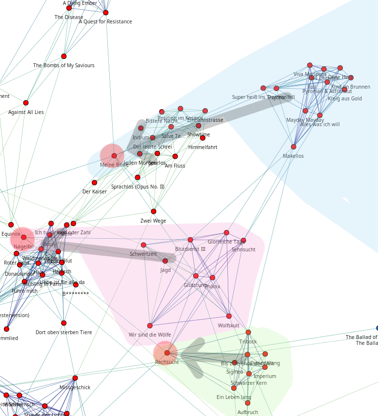

############################
Implizites Lernen vom Nutzer
############################

Generierung von Regeln
======================

:dropcaps:`In` vorangegangenen Kapiteln wurde schon oft davon gesprochen, dass
*libmunin* den Nutzer *beobachtet*. Dies geschieht, indem der
Anwendungsentwickler, die vom Nutzer gehörten Titel, an *libmunin* zurückmeldet.

Finden von wiederkehrenden Mustern
----------------------------------

Um eine *,,Warenkorbanalyse"* durchzuführen, braucht man erstmal *Warenkörbe*.
Diese entstehen, indem man die einzelnen Songs in der Historie zeitlich
gruppiert. Wächst eine Gruppe über eine Grenze (momentan :math:`5`), so wird
eine neue Gruppe begonnen.

Diese einzelnen Gruppen von Songs fungieren dann als *Warenkörbe.* Aus diesen
gilt es zuerst eine Menge an Songs (im Folgenden *Muster* [#f1]_ genannt) zu
finden, die jeweils oft zusammen in den einzelnen Warenkörben vorkommen. Der
naive Ansatz wäre, für jede Kombination der Eingabesongs, das Vorkommen
derselben, im Warenkorb zu zählen. Wie man sich bereits denken kann, ist
hierfür der algorithmische Aufwand enorm, denn bereits bei einer Menge von
:math:`1000` unterschiedlichen Songs in der Historie, müssten bereits
:math:`2^{n}-1` Kombinationen gebildet werden. Denn ein Warenkorb kann man als
einer Menge von sich nicht wiederholender Songs sehen, bei der auch die
Reihenfolge keine Rolle spielt.

Für die Lösung dieses Problems, gibt es einige etablierte Algorithmen.  Der
bekannteste ist vermutlich der *Apriori--Algorithmus* (vergleiche
:cite:`datamining-concepts-and-techniques`, S. 248--253). Statt alle
Kombinationen zu betrachten, werden erst alle *,,Einer--Kombinationen"* gebildet
und die ausgefiltert, welche einen zu niedrigen *Support--Count* besitzen. Die
Grenze legt man vorher fest. Der *Support--Count* :math:`support(A)` ist die
Anzahl der *Warenkörbe*, in denen die Menge von Songs :math:`A` vorkommt, geteilt
durch die absolute Anzahl der Warenkörbe. Danach werden mit den verbliebenen
Zweier--Kombination gebildet, wieder gefiltert, dann die noch relevanten
Dreier--Kombinationen und so weiter. Dadurch wird eine große Menge von
Kombinationen vermieden.

Seit einiger Zeit haben sich jedoch eine Gruppe effizienterer Algorithmen
etabliert. Dazu gehören der FP--Growth (siehe
:cite:`datamining-concepts-and-techniques` S. 257--259, 272), Eclat (siehe
:cite:`ECLAT`), sowie der hier verwendete ``RELIM``--Algorithmus, der in
:cite:`RELIM` vorgestellt wurde.

.. |x| replace:: :math:`\times`

.. figtable::
   :label: table-itemsets
   :spec: l r | l r | l r
   :alt: Die Muster für einige einfache Warenkörbe 
   :caption: Die Muster, welche aus den drei Warenkörben {{A, B, C} {B, B, C},
             {C, C, B}} generiert worden sind, mit der jeweiligen Anzahl von
             Vorkommnissen in den Warenkörben.

   =================== ====== =================== ====== =================== ======
   *Kombination* (1er)        *Kombination (2er)*        *Kombination (3er)* 
   =================== ====== =================== ====== =================== ======
   *A*                 1 |x|  *A, B*              1 |x|  *A, B, C*           1 |x|  
   *B*                 3 |x|  *B, C*              3 |x|                      |nbsp|
   *C*                 3 |x|  *C, A*              1 |x|                      |nbsp|
   =================== ====== =================== ====== =================== ======

In Tabelle :num:`table-itemsets` sieht man ein Beispiel aus drei Warenkörben,
aus denen per Hand mit der naiven Herangehensweise alle möglichen Kombinationen
samt deren Support--Count, aufgelistet worden sind.

Der ``RELIM``--Algorithmus
--------------------------

Generell gilt FP--Growth als der neue Standard--Algorithmus, der laut mehrerer
Quellen andere Algorithmen wie Eclat und ``RELIM`` (``RE``--*cursive* ``ELIM``--*ination*)
aussticht :cite:`gyHorodi2004comparative` :cite:`santhosh2010implementation`.
In diesem Fall wird trotzdem auf ``RELIM`` zurückgegriffen, da dieser für die
Zwecke des Autors ausreichend schnell ist und die Datenmenge nie mehr als wenige
tausend Songs übersteigen wird. Zudem gibt es mit dem Python--Paket *pymining*
(siehe :cite:`pymining`) bereits eine freie, qualitativ hochwertige
Implementierung, während es für FP--Growth nur qualitativ schlechte
Implementierungen zu geben scheint, oder welche, die nur für Python--Versionen
:math:`\leq 2,7` funktionieren.

Ableitung von Regeln aus Mustern
--------------------------------

Hat man eine Gruppe von häufig zusammen auftretenden Song--Kombinationen
gefunden, so können daraus Assoziationsregeln abgeleitet werden.
Eine Assoziationsregel verbindet zwei Mengen *A* und *B* von Songs mit
einer gewissen Wahrscheinlichkeit miteinander. Sie besagen, dass wenn eine
der beiden Mengen miteinander gehört wird, dann ist es wahrscheinlich,
dass auch die andere Menge daraufhin angehört wird.  Regeln werden aus dem
Verhalten des Nutzers abgeleitet. Dazu wird jedes Lied, das der Nutzer
anhört, in einer *Historie* zwischengespeichert.
Um die generelle Anwendbarkeit der Regel zu beschreiben, wird für jede
Regel ein *Rating* berechnet.

*Anmerkung:* Im allgemeinen Gebrauch sind Assoziationsregeln nur in eine
Richtung definiert.  In *libmunin* sind die Regeln aus Gründen der
Einfacheit allerdings bidirektional. So gilt nicht nur, dass man
wahrscheinlich die Menge *B* hört, wenn man *A* gehört hat (:math:`A
\rightarrow B`), sondern auch umgekehrt (:math:`A \leftrightarrow B`).
Ein natürlichsprachliches Beispiel hierfür: :math:`\frac{2}{3}` der
Basketballspieler essen Cornflakes (:math:`Basketball \Rightarrow Cornflakes`).
Diese Regel besagt, dass der größere Teil der Basketballspieler Cornflakes isst,
aber nicht, dass die meisten Cornflakes--Esser Basketballspieler sind. Da bei
*libmunin* auf beiden Seiten der Regel immer der gleiche Typ (ein oder mehrere
Songs) steht und die Beziehung immer *,,werden miteinander gehört"* ist, wird
hier vereinfachend eine bidirektionale Assoziation angenommen. Dies erlaubt ein
Anwenden der Regeln in beide Richtungen. 

Um nun aus einem Muster Regeln abzuleiten, teilt man es in alle möglichen
verschiedenen, disjunkten Teilmengen auf --- allerdings in maximal zwei
Teilmengen.  Diese beiden Teilmengen nimmt man als die beiden Mengen einer
Assoziationsregel an und testet, mittels verschiedener Metriken, wie zutreffend
diese ist. 

.. figtable::
   :label: table-rules
   :spec: l | l l l l
   :alt: Mögliche Regeln, die aus den drei warenkörben erstellt werden können
   :caption: Mögliche Regeln, die aus den drei Warenkörben erstellt werden können.
             Zusätzlich wird der dazugehörige Gesamt--Support--Count, sowie der
             Metriken Imbalance--Ratio, Kulczynski und Lift abgebildet.

   ==================================================================== ====================== ======================= ====================== =============
   *Assoziationsregel*                                                  *Support*              *Imbalance Ratio*       *Kulczynski*           *Lift*
   ==================================================================== ====================== ======================= ====================== =============
   :math:`\left\{A\right\} \leftrightarrow \left\{B\right\}`            :math:`0,\overline{3}` :math:`0,\overline{6}`  :math:`0,\overline{6}` 0
   :math:`\left\{B\right\} \leftrightarrow \left\{C\right\}`            :math:`1,0`            :math:`0`               :math:`1`              0
   :math:`\left\{C\right\} \leftrightarrow \left\{A\right\}`            :math:`0,\overline{3}` :math:`0,\overline{6}`  :math:`0,\overline{6}` 0 
   |hline| :math:`\left\{A\right\} \leftrightarrow \left\{B, C\right\}` :math:`0,\overline{3}` :math:`0,\overline{6}`  :math:`0,\overline{6}` 0
   :math:`\left\{B\right\} \leftrightarrow \left\{A, C\right\}`         :math:`0,\overline{3}` :math:`0`               :math:`0,\overline{3}` 0 
   :math:`\left\{C\right\} \leftrightarrow \left\{A, B\right\}`         :math:`0,\overline{3}` :math:`0,\overline{6}`  :math:`0,\overline{6}` :math:`0,\overline{8}`
   ==================================================================== ====================== ======================= ====================== =============

Als Beispiel kann man wieder die Warenkörbe aus Tabelle :num:`table-itemsets` nehmen.
Muster mit nur einem Song können nicht weiter aufgeteilt werden, daher müssen
diese nicht weiter betrachtet werden. Die Zweier--Kombination sind leicht in zwei
disjunkte Teilmengen aufteilbar. Für die Dreier--Kombinationen können mehrere
mögliche Teilmengen erstellt werden. Die einzelnen möglichen Regeln werden in
Tabelle :num:`table-rules` aufgelistet.

.. figtable::
   :label: table-cornflakes
   :spec: r | c c c
   :alt: Vierfeldertafel mit Beispieldaten
   :caption: Vierfeldertafel mit erfundenen Beispieldaten. Es werden 1000
             Studenten untersucht, bei denen die Eigenschaften ,,Spielt
             Basketball” und ,,Isst Cornflakes” festgestellt worden sind. 

   ================================ ===================== =============================== ==============
       **Eigenschaft**               :math:`Basketball`   :math:`\overline{Basketball}`   :math:`\sum`  
   ================================ ===================== =============================== ==============
     :math:`Cornflakes`               400                 350                              750          
     :math:`\overline{Cornflakes}`    200                 50                               250          
     |hline| :math:`\sum`             600                 400                              1000         
   ================================ ===================== =============================== ==============

Nicht jede Regel ist automatisch eine gute Regel.  Ein gängiges Lehrbeispiel
wäre hier die Regel :math:`Basketball \Rightarrow Cornflakes`, also eine Regel,
die laut Tabelle :num:`table-cornflakes` besagt, dass :math:`\frac{2}{3}` aller
*Basketballspieler* zum Frühstück *Cornflakes* essen.  Der Anteil der Menschen
die aber insgesamt Cornflakes essen liegt aber bei :math:`75\%` --- daher ist
die Eigenschaft *,,Basketballspieler"* sogar im Vergleich, zum durchschnittlichen
Anteil von Cornflake--Essern, ein Gegenindiz für diese Eigenschaft.

Um solche kontraproduktiven Assoziationsregeln zu vermeiden, werden für jede
Regel zwei Metriken errechnet. Die von *libmunin* genutzten Metriken wurden dem
Buch *Datamining Concepts and Techniques*
(:cite:`datamining-concepts-and-techniques`, S. 268--271) entnommen: Die
*Kulczynski--Metrik* und der *Imbalance--Ratio*. 

Die *Kulczynski--Metrik* drückt die Güte der Regel als eine reelle Zahl im
Bereich :math:`\lbrack 0, 1\rbrack` aus, wobei :math:`1` die beste Wertung ist.
Grob ausgedrückt besagt die Metrik, wie zutreffend die Regel im Durchschnitt
ist. ``A`` und ``B`` sind im Folgenden die beiden nicht--leeren Teilmengen der
Regel:

.. math::

    Kulczynski(A, B) =  \frac{1}{2} \times \big(P(A \mid B) + P(B \mid A)\big)

Diese Metrik ist der Durchschnitt aus zwei Variationen einer anderen Metrik: Dem
*confidence*--Measure (vergleiche :cite:`datamining-concepts-and-techniques`, S. 254f.):

.. math::
    
    confidence(A \rightarrow B) = P(A\mid B) = \frac{P(A\cap B)}{P(B)} = \frac{support(A \cap B)}{support(B)}    

Diese Metrik gibt an, zu welchem Prozentsatz die Regel zutrifft. Ist der Quotient
:math:`1`, so trifft die Regel bei jedem bekannten Warenkorb zu.  Der Zähler
:math:`support(A\cap B)` beschreibt hier, wie oft sowohl *A* und *B*
gleichzeitig in einem Warenkorb vorkommen. 
Bereits allein ist diese Metrik ein
gutes Indiz für die Korrektheit einer Regel, die Kulczynski--Metrik prüft
zusätzlich beide Seiten der Regel.  Um zu zeigen wie sich die Kulczynski--Metrik
berechnen lässt, können wir die obige Definition umstellen:

.. math::

   Kulczynski(A, B) = \frac{1}{2} \times \left(\frac{support(A\cap B)}{support(B)} + \frac{support(A\cap B)}{support(A)}\right) 

Diese Metrik allein reicht allerdings nicht für eine qualitative Einschätzung
einer Regel. Zwar kann die Regel oft zutreffen, doch kann sie, wie im obigen
Beispiel mit den *Cornflakes*, trotzdem kontraproduktiv sein. 
Daher wird mit dem *Imbalance Ratio* eine weitere Metrik
eingeführt. Der *Imbalance Ratio* gibt im Bereich :math:`\lbrack 0, 1\rbrack`
an, wie unterschiedlich beide Seiten der Regel sind. Treten die Muster
unterschiedlich oft auf, so steigt diese Metrik. Hier ist der beste Wert die
:math:`0`, der Schlechteste eine :math:`1`.   Er ist gegeben durch:

.. math::

    ImbalanceRatio(A, B) = \frac{\vert support(A) - support(B)\vert}{support(A) + support(B) - support(A \cap B)}

Sollte die *Kulczynski--Metrik* kleiner als :math:`0,\overline{6}` sein oder der
*Imbalance--Ratio* größer als :math:`0,35`, so wird die Regel fallen gelassen.
Diese Grenzwerte wurden, mehr oder minder willkürlich, nach einigen Tests
festgelegt.  Sollte die Regel akzeptabel sein, dann werden beide Metriken in
eine einzelne, leichter zu handhabende *Rating--Metrik* verschmolzen:

.. math::

    Rating(A, B) = \left(1 - ImbalanceRatio(A, B)\right) \times Kulczynski(A, B)

Dieses *Rating* wird genutzt, um die einzelnen Assoziationsregeln zu sortieren.
Das finale Rating bewegt sich im Bereich :math:`\lbrack 0, 1\rbrack`, wobei
:math:`1` das höchste vergebene Rating ist.

Nach einigen Tests erwiesen sich beide Metriken aber nicht als ausreichend um
schwache Regeln zu filtern.  Daher wurde noch zusätzlich die *Lift--Metrik*
eingeführt (vergleiche :cite:`datamining-concepts-and-techniques`, S.266). Diese
ist definiert als: 

.. math::

   Lift(A, B) = P(A \mid B) - (P(A) \times P(B)) = support(A \cap B) - \left(support(A) \times support(B)\right)

Sie vergleicht das erwartete gemeinsame Auftreten der Mengen ``A`` und ``B`` mit
dem tatsächlichen Auftreten in den Warenkörben.  Ist der berechnete Wert
:math:`< 0`, so korreliert das Auftreten von ``B`` negativ mit ``A``.  In diesem
Fall wird die Regel ignoriert.  Werte größer oder gleich :math:`0` bedeuten eine
positive/neutrale Korrelation.  Das Auftreten von ``B`` impliziert das
wahrscheinliche Auftreten von ``A``.  Für die unter Tabelle
:num:`table-cornflakes` gezeigten Werte können nun die einzelnen Metriken
angewandt werden: 

.. math::

   Kulczynski(Basketball, Cornflakes) = \frac{1}{2} \times \left(\frac{400}{600} + \frac{400}{750}\right) = 0,6

Dieses Ergebnis würde zum Ausschluss der Regel führen, da :math:`0,6 <
0.\overline{6}` ist.  Allerdings ist dies, für diese kontraproduktive Regel, ein
knappes Ergebnis, da die Grenze von :math:`\overline{0,6}` willkürlich
gewählt wurde.

.. math::

   ImbalanceRatio(Basketball, Cornflakes) = \frac{\vert 750 - 600 \vert}{750 + 600  - 400} \;\;\approx{0,16}

Beim *ImbalanceRatio* war :math:`0` der beste anzunehmende Wert. Laut dem
Ergebnis von :math:`0,16` wäre diese Regel also sogar gut balanciert.

.. math::

    Lift(Basketball, Cornflakes) = \frac{400}{1000} - \left( \frac{750}{1000} \times \frac{600}{1000} \right) = -0,05

Der *Lift* führt mit einem Ergebnis :math:`< 0` zu einer definitiven Filterung 
der Regel.

Anwendung von Regeln
====================

Wie bereits unter Kapitel :ref:`ref-graphops-rules` erklärt, werden Assoziationsregel
als Navigationshilfe beim Traversieren genutzt.  Zu diesem Zwecke müssen die
entstandenen Regeln irgendwo sortiert abgelegt werden.  Diese Ablage ist der
``RuleIndex``. Beim Einfügen wird jeweils überprüft, ob die Maximalanzahl an
Regeln (momentan maximal :math:`1000`) übertroffen wird. Sollte dem so sein,
wird die älteste (ergo, zu erst eingefügte) Regel gelöscht, um Platz zu machen. 
Der Anwendungsentwickler kann mittels der ``lookup(song)``--Methode eine Liste
von Regeln abfragen, die diesen Song in irgendeiner Weise betreffen. Um diese
Operation zu beschleunigen, wird intern eine Hashtabelle gehalten, mit dem Song
als Schlüssel und der entsprechende Regel--Liste als zugehöriger Wert.
Bei jeder Operation auf dem ``RuleIndex`` wird dieser automatisch bereinigt. 
Dabei werden Regeln entfernt, die Songs erwähnen, welche nicht mehr in der
Historie vertreten sind. 

Lernerfolg
==========

Noch sind keine Aussagen darüber möglich, wie gut die momentane Lernstrategie
funktioniert. Einerseits ist es schwer festzustellen was *,,gut"* bedeutet,
andererseits wurde eine *libmunin--Session* noch nie lange genug benutzt,
um Aussagen über die Langzeitfunktionalität zu geben. 

Daher ist die oben genannte Vorgehensweise als ,,Hypothese" zu sehen, die sich
erst noch in der Praxis bewähren muss. Änderungen sind wahrscheinlich.
Zudem muss auch auf Seite der Implementierung noch ein Detail verbessert werden:
Momentan wird nur die Historie aufgezeichnet, wenn die Demonanwendung läuft. Da
die Anwendung lediglich eine Fernbedienung für den MPD ist, läuft diese nicht
die ganze Zeit über. Abhilfe würde ein separater MPD--Client, der nur dafür
dient, im Hintergrund die Historie--Daten mitzuloggen.

Explizites Lernen
=================

.. subfigstart::

.. _fig-move-before:

.. figure:: figs/big_move_before_edit.png
    :alt: Graph vor dem Vergeben eines hohen Ratings.
    :width: 95%
    :align: center
    
    Vor dem Vergeben der Ratings.

.. _fig-move-after:

    
    Nach dem Vergeben der Ratings. Die Bewegung wird durch Pfeile angedeutet.

.. subfigend::
    :width: 0.75
    :alt: Graph vor und nach Vergeben eines hohen Ratings
    :label: fig-modify-moves
 
    Vor und nach dem Vergeben von einem hohen Rating an drei Lieder 
    (,,Rachsucht”, ,,Nagelfar”, ,,Meine Brille”, jeweils rot eingekreist). 
    Die dazugehörigen Alben sind in rötlich, grünlich und bläulich
    hervorgehoben. Nach dem Vergeben sieht man, dass die entsprechenden Songs
    sich von den einzelnen Alben--Clustern räumlich entfernt haben und
    Verbindungen zu anderen Alben bekommen haben. Zudem haben sich die beiden
    erstgenannten Songs miteinander verbunden.

Bei einer ``insert``--Operation lässt sich beobachten, dass die eingefügten
Songs deutlich deutlich weitläufiger verbunden sind, als regulär per ``add``
hinzugefügte. Diese Eigenschaft macht sich die in der Projektarbeit
(:cite:`aaa_cpahl`, S.37ff) gezeigte Demonanwendung zu Nutze: Ändert man das Rating eines
Songs, so wird der Song mittels ``remove`` gelöscht und mittels  ``insert`` an
anderer Stelle wieder eingefügt. Meist verbindet sich dabei der Song, dann mit
anderen ähnlich bewerteten Songs. Diese bilden ein *zusätzliches Netz* über dem
Graphen, welches weitläufigere Sprünge ermöglicht.  Dadurch hat der Nutzer eine
Möglichkeit den Graphen seinen Vorstellungen nach umzubauen.

Unter Abbildung :num:`fig-modify-moves` soll dieses ,,explizite Lernen" nochmal
visualisiert werden. Die dort abgebildete Verschiebung ist dadurch zu erklären,
dass die ``insert``--Operation meist einen anderen Punkt zum Wiedereinfügen
findet.  Durch Ändern des Ratings in der Demonanwendung, können daher einzelne
Knoten gezielt im Graphen bewegt werden. Knoten mit ähnlichem Rating wandern
näher zusammen und stellen *,,Brücken"* zu anderen Alben--Clustern her. Man kann
dieses *Feature* einerseits dazu nutzen, um seine Favoriten nahe im Graphen
zusammenzupacken, andererseits, um unpassende Empfehlungen mit einem schlechten
Rating abzustrafen. Letzeres hätteeine ``insert``--Operation auf diesen Song zur
Folge, wodurch er möglicherweise an anderer Stelle besser eingepasst wird.

Der *,,Mechanismus"* des *expliziten Lernens* ist war mehr ein Nebeneffekt der
Entwicklung. Zukünftige Versionen könnten leichter steuerbar und intuitiver
verständliche Mechanismen anbieten.  Ein Ansatz wäre der Weg, den *Intelligente
Playlisten* bei vielen Music--Playern gehen: Der Nutzer stellt Beziehungen
zwischen Attributen und Werten her. Ein Attribut wäre beispielsweise ``date``,
ein Wert ``2010`` und eine Beziehung :math:`\ge`.  Weitere Beziehungen wären
:math:`=`, :math:`\neq`, :math:`<` oder :math:`\le`. 
Mit den unterschiedlichen Attributen, wären dann automatisch erstellte
Playlisten wie  *,,Favouriten"* (:math:`rating > 3`), *,,Ungehörte"*
(:math:`Playcount = 0`) und *,,Neu Hinzugefügte"* (:math:`date > (today - 7
\times days)`) möglich.  Für Letzere könnten hilfreiche Konstanten wie :math:`today`
eingeführt werden.

.. rubric:: Footnotes

.. [#f1] In englischer Lektüre werden die *Wiederkehrenden Muster* als *Frequent
   Itemsets* bezeichnet.
