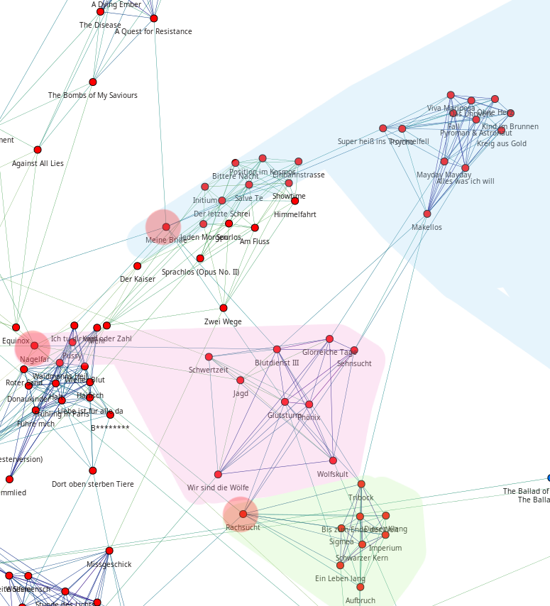

############################
Implizites Lernen vom Nutzer
############################

Generierung von Regeln
======================

:dropcaps:`In` vorangegangen Kapiteln wurde schon oft davon gesprochen, dass
*libmunin* den Nutzer *,,beobachtet"*. Dies geschieht indem der
Anwendungsentwickler, die vom Nutzer gehörten Titel an *libmunin* zurückmeldet.

Finden von wiederkehrenden Mustern
----------------------------------

Um eine *,,Warenkorbanalyse"* durchzuführen braucht man erstmal *Warenkörbe*.
Die Entstehung dieser wurde bereits in der Projektarbeit betrachtet: Die
einzelnen Songs in der Historie werden zeitlich gruppiert und bei einer maximalen
Gruppengröße abgeschnitten. 

Diese einzelnen Gruppen von Songs fungieren dann als *Warenkörbe.* Aus diesen
gilt es zuerst eine Menge an Songs (im Folgenden *Muster* [#f1]_ genannt) zu
finden, die jeweils oft zusammen in den einzelnen Warenkörben vorkommen. Der
*naive* Ansatz wäre für jede Kombination der Eingabesongs das Vorkommen jeder
Kombination im Warenkorb zu zählen. Wie man sich bereits denken kann, ist
hierfür der algorithmische Aufwand enorm, denn bereits bei einer Menge von
:math:`1000` unterschiedlichen Songs in der Historie müssten bereits
:math:`1000!` Kombinationen gebildet werden. 

Für die Lösung dieses Problems gibt es einige etablierte Algorithmen.  Der
bekannteste ist vermutlich der *Apriori--Algorithmus* (vergleiche
:cite:`datamining-concepts-and-techniques`, S. 248--253). Statt alle
Kombinationen zu betrachten, werden erst alle *,,Einer--Kombinationen"* gebildet
und die ausgefiltert, welche einen zu niedrigen *Support--Count* besitzen. Die
Grenze legt man vorher fest. Der *Support--Count* ist einfach die Anzahl der
*Warenkörbe* in dem ein Song vorkommt, geteilt durch die absolute Anzahl der
Warenkörbe. Danach werden mit den Verbliebenen 2er--Kombination gebildet, wieder
gefiltert, dann die noch relevanten 3er--Kombinationen und so weiter. Dadurch
wird eine große Menge von Kombinationen vermieden.

Seit einiger Zeit haben sich jedoch eine Gruppe effizienterer (und damit
einhergehend schwerer zu erklärender) Algorithmen etabliert. Dazu gehören der
FP--Growth (siehe :cite:`datamining-concepts-and-techniques` S. 257--259, 272),
Eclat (siehe :cite:`ECLAT`), sowie der hier verwendete ``RELIM``--Algorithmus
der in :cite:`RELIM` vorgestellt wurde.

.. |x| replace:: :math:`\times`

.. figtable::
   :label: table-itemsets
   :spec: l r | l r | l r
   :alt: Die Muster für einige einfache Warenkörbe 
   :caption: Die Muster, welche aus den drei Warenkörben {{A, B, C} {B, B, C},
             {C, C, B}} generiert worden sind.

   ================== ====== ================= ====== ================= ======
   Kombination (1er)  Anzahl Kombination (2er) Anzahl Kombination (3er) Anzahl    
   ================== ====== ================= ====== ================= ======
   *A*                1 |x|  *A, B*            1 |x|  *A, B, C*         1 |x|  
   *B*                3 |x|  *B, C*            3 |x|                    |nbsp|
   *C*                3 |x|  *C, A*            1 |x|                    |nbsp|
   ================== ====== ================= ====== ================= ======

In Tabelle :num:`table-itemsets` sieht man ein Beispiel aus drei Warenkörben,
aus denen per Hand mit der naiven Herangehensweise alle möglichen Kombinationen
samt deren Support--Count aufgelistet worden sind.

Der ``RELIM``--Algorithmus
--------------------------

Generell gilt FP--Growth als der neue Standard--Algorithmus, der laut mehrerer
Quellen andere Algorithmen wie Eclat und ``RELIM`` (``RE``--*cursive* ``ELIM``--*ination*)
aussticht :cite:`gyHorodi2004comparative` :cite:`santhosh2010implementation`.

In diesem Fall wird trotzdem auf ``RELIM`` zurückgegriffen, da dieser für die
Zwecke des Autors ausreichend schnell ist und die Datenmenge nie mehr als wenige
tausend Songs überstiegen wird. Zudem gibt es mit dem Python--Paket *pymining*
(siehe :cite:`pymining`) bereits eine freie, qualitativ relativ hochwertige
Implementierung, während es für FP--Growth nur qualitativ schlechte
Implementierungen zu geben scheint, oder welche, die nur für Python--Versionen
:math:`\leq 2.7` funktionieren.

Ableitung von Regeln aus Mustern
--------------------------------

Hat man erstmal eine Gruppe von häufig zusammen auftretender
Song--Kombinationen, so können daraus Assoziationsregeln abgeleitet werden.
Dazu teilt man das Muster in alle möglichen verschiedenen, disjunkten Teilmengen
auf. Allerdings in maximal zwei Teilmengen.  Diese beiden Teilmengen nimmt man
als die beiden *Mengen* einer :term:`Assoziationsregel` an und probt, mittels
verschiedener *Metriken*, wie zutreffend diese ist. 

.. figtable::
   :label: table-rules
   :spec: l | l l l l
   :alt: Mögliche regeln die aus den 3 warenkörben erstellt werden können
   :caption: Mögliche Regeln die aus den drei Warenkörben erstellt werden können.
             Zusätzlich wird der dazugehörige Gesamt--Support--Count, sowie die
             beiden Metriken Imbalance--Ratio und Kulczynski abgebildet.

   ==================================================================== ====================== ======================= ============
   *Assoziationsregel*                                                  *Support*              *Imbalance Ratio*       *Kulczynski*
   ==================================================================== ====================== ======================= ============
   :math:`\left\{A\right\} \leftrightarrow \left\{B\right\}`            :math:`0.\overline{3}` :math:`0.\overline{6}`  :math:`0.\overline{6}`
   :math:`\left\{B\right\} \leftrightarrow \left\{C\right\}`            :math:`1.0`            :math:`0`               :math:`1`
   :math:`\left\{C\right\} \leftrightarrow \left\{A\right\}`            :math:`0.\overline{3}` :math:`0.\overline{6}`  :math:`0.\overline{6}`
   |hline| :math:`\left\{A\right\} \leftrightarrow \left\{B, C\right\}` :math:`0.\overline{3}` :math:`0.\overline{6}`  :math:`0.\overline{6}`
   :math:`\left\{B\right\} \leftrightarrow \left\{A, C\right\}`         :math:`0.\overline{3}` :math:`0`               :math:`0.\overline{3}`
   :math:`\left\{C\right\} \leftrightarrow \left\{A, B\right\}`         :math:`0.\overline{3}` :math:`0.\overline{6}`  :math:`0.\overline{6}`
   ==================================================================== ====================== ======================= ============

Als Beispiel können wir wieder die Warenkörbe aus :num:`table-itemsets` nehmen.
Muster mit nur einem Song können nicht weiter aufgeteilt werden, daher müssen
diese nicht weiter betrachtet werden. Die 2er--Kombination sind leicht in zwei
Teilmengen aufzuteilen. Für die 3er--Kombinationen können mehrere möglichen
Teilmengen erstellt werden. Die einzelnen möglichen Regeln werden in
:num:`table-rules` aufgelistet.

Nicht jede Regel ist automatisch eine gute Regel. Das gängige Lehrbeispiel
hierbei ist eine Regel die besagt, dass :math:`60\%` aller *Basketballspieler*
zum Frühstück *Cornflakes* essen.  Der Anteil der Menschen die aber insgesamt
Cornflakes essen liegt bei :math:`70\%` --- daher ist die Eigenschaft
*,,Basketballspieler"* sogar ein Gegenindiz für die Eigenschaft
*,,Cornflake--Esser"*.

Um solche kontraproduktiven Assoziationsregeln zu vermeiden, werden für jede
Regel zwei Metriken errechnet. Die von *libmunin* genutzten Metriken wurde dem
Buch *Datamining Concepts and Techniques*
(:cite:`datamining-concepts-and-techniques`, S. 268--271) entnommen: Die
*Kulczynski--Metrik* und der *Imbalance--Ratio*.

Die *Kulczynski--Metrik* drückt die *Güte* der Regel als eine reele Zahl im
Bereich :math:`\lbrack 0, 1\rbrack` aus, wobei :math:`1` die beste Wertung ist.
Grob ausgedrückt besagt die Metrik, wie zutreffend die Regel im Durchschnitt
ist. ``A`` und ``B`` sind im Folgenden die beiden Teilmengen der Regel:

.. math::

    Kulczynski(A, B) =  \frac{1}{2} \times \big(P(A \mid B) + P(B \mid A)\big)

Diese Metrik ist der Durchschnitt aus zwei Variationen einer anderen Metrik: Dem
*confidence*--Measure (vergleiche :cite:`datamining-concepts-and-techniques`, S. 254f.):

.. math::
    
    confidence(A \rightarrow B) = P(A\mid B) = \frac{P(A\cap B)}{P(B)} = \frac{support(A \cup B)}{support(B)}    

Diese Metrik gibt an zu welchem Prozentsatz die Regel zutrifft. Ist der Quotient
:math:`1`, so trifft die Regel bei jedem bekannten Warenkorb zu.  Der Zähler
:math:`support(A\cup B)` beschreibt hier, wie oft sowohl *A* und *B*
gleichzeitig in einem Warenkorb vorkommen.  Bereits allein ist diese Metrik ein
gutes Indiz für die Korrektheit einer Regel, die Kulczynski--Metrik prüft
lediglich beide Seiten der Regel.  Um zu zeigen wie sich die Kulczynski--Metrik
berechnen lässt, können wir die obige Definition umstellen:

.. math::

   Kulczynski(A, B) = \frac{1}{2} \times \left(\frac{support(A\cup B)}{support(B)} + \frac{support(A\cup B)}{support(A)}\right)

Diese Metrik allein reicht allerdings nicht für eine qualitative Eisnchätzung
einer Regel. Zwar kann die Regel oft zutreffen, doch kann sie, wie im obigen
Beispiel mit den *Cornflakes*, trotzdem kontraproduktiv sein. 
Daher wird mit dem *Imbalance Ratio* eine weitere Metrik
eingeführt. Der *Imbalance Ratio* gibt im Bereich :math:`\lbrack 0, 1\rbrack`
an, wie unterschiedlich beide Seiten der Regel sind. Treten die Regeln
unterschiedlich oft auf, so steigt diese Metrik Hier ist der beste Wert die
:math:`0`, der Schlechteste eine :math:`1`.   Er ist gegeben durch:

.. math::

    ImbalanceRatio(A, B) = \frac{\vert support(A) - support(B)\vert}{support(A) + support(B) - support(A \cup B)}

Sollte die *Kulczynski--Metrik* kleiner als :math:`0.\overline{6}` sein oder der
*Imbalance--Ratio* größer als :math:`0.35`, so wird die Regel fallen gelassen.
Diese Grenzwerte wurden, mehr oder minder willkürlich, nach einigen Tests
festgelegt.  Sollte die Regel *akzeptabel* sein, dann werden beide Metriken in
eine einzelne, leichter zu handhabendes *Rating--Metrik* verschmolzen:

.. math::

    Rating(A, B) = \left(1 - ImbalanceRatio(A, B)\right) \times Kulczynski(A, B)

Dieses *Rating* wird genutzt, um die einzelnen Assoziationsregeln zu sortieren.
Das finale Rating bewegt sich im Bereich :math:`\lbrack 0, 1\rbrack`, wobei
:math:`1` das höchste vergebene Rating ist.

Anwendung von Regeln
====================

Wie bereits unter :ref:`ref-graphops-rules` erklärt, werden Assoziationsregel
als Navigationshilfe beim Traversieren genutzt.  Zu diesem Zwecke müssen die
entstandenen Regeln irgendwo sortiert abgelegt werden.  Diese Ablage ist der
``RuleIndex``. Beim Einfügen wird jeweils überprüft, ob die Maximalanzahl an
Regeln (momentan maximal :math:`1000`) übertroffen wird. Sollte dem so sein,
wird die älteste (ergo, zu erst eingefügte) Regel gelöscht um Platz zu machen. 

Der Anwendungsentwickler kann mittels der ``lookup(song)``--Methode eine Liste
von Regeln abfragen, die diesen Song in irgendeiner Weise betreffen. Um diese
Operation zu beschleunigen, wird intern eine Hashtabelle gehalten, mit dem Song
als Schlüssel und der entsprechende Regel--Liste als zugehöriger Wert.
Bei jeder Operation auf dem ``RuleIndex`` wird er automatisch bereinigt. 
Dabei werden Regeln entfernt, die Songs erwähnen, welche nicht mehr in der
Historie vertreten sind. 

Lernerfolg
==========

Noch sind keine Aussagen darüber möglich wie *gut* die momentane Lernstrategie
funktioniert. Einerseits ist es schwer festzustellen was *gut* bedeutet,
andererseits wurde eine *libmunin--Session* noch nie lange genug benutzt,
um Aussagen über die Langzeitfunktionalität zu geben. 

Daher ist die oben genannte Vorgehensweise als *,,Theorie"* zu sehen, die sich
erst noch in der Praxis bewähren muss. Änderungen sind wahrscheinlich.

Zudem muss auch auf Seite der Implementierung noch ein Detail verbessert werden:
Momentan wird nur die Historie aufgezeichnet, wenn die Demonanwendung läuft. Da
die Anwendung lediglich eine Fernbedienung für den MPD ist, läuft diese nicht
die ganze Zeit über. Eine Abhilfe würde ein gepatchter MPD--Server schaffen, der
sich seine Historie merkt oder eine separater MPD--Client der nur dafür dient im
Hintergrund die Historie--Daten mitzuloggen.

Explizites Lernen
=================

.. subfigstart::

.. _fig-move-before:

.. figure:: figs/big_move_before_edit.png
    :alt: Graph vor dem Vergeben eines hohen Ratings.
    :width: 97%
    :align: center
    
    Vor dem Vergeben der Ratings.

.. _fig-move-after:

    
    Nach dem Vergeben der Ratings.

.. subfigend::
    :width: 0.75
    :alt: Graph vor und nach Vergeben eines hohen Ratings
    :label: fig-modify-moves
 
    Vor und nach dem Vergeben von einem hohen Ratings an drei Lieder 
    (,,Rachsucht”, ,,Nagelfar”, ,,Meine Brille”, jeweils rot eingekreist). 
    Die dazugehörigen Alben sind in rötlich, grünlich und bläulich
    hervorgehoben. Nach dem Vergeben sieht man, dass die entsprechenden Songs
    sich von den einzelnen Albums--Cluster entfernt haben und Verbindungen zu
    anderen Album bekommen haben. Zudem haben sich die beiden erstgenannten
    Songs miteinander verbunden.

Neben dem *impliziten Lernen* gibt es auch den *,,nachträglich entdeckten"*
Mechanismus des *expliziten Lernens*. Dieser wurde bereits in Kapitel
:ref:`ref-graphop-insert` beleuchtet. Unter Abbildung :num:`fig-modify-moves` soll
dies lediglich nochmal visualisiert werden. Die dort abgebildete *Verschiebung*
ist dadurch zu erklären, dass die ``insert``--Operation meist einen anderen zum
Wiedereinfügen findet. 

Durch Ändern des *Ratings* in der Demonanwendung können einzelne Knoten gezielt
im Graphen bewegt werden. Knoten mit ähnlichem Rating wandern näher zusammen und
stellen *,,Brücken"* zu anderen Album--Clustern her. Man kann dieses *Feature*
einerseits dazu nutzen, um seine Favoriten nahe im Graphen zusammenzupacken,
andererseits, um unpassende Empfehlungen mit einem schlechten Rating
abzustrafen, was eine ``insert``--Operation auf diesen Song zur Folge hätte.
Dadurch wird er möglicherweise an anderer Stelle besser eingepasst.

Der *,,Mechanismus"* des *expliziten Lernens* ist relativ debattierbar und war
mehr ein Nebeneffekt der Entwicklung. Zukünftige Versionen könnten leichter
steuerbar und intuitiver verständliche Mechanismen anbieten.  Ein Ansatz wäre
der Weg, den *Intelligente Playlisten* bei vielen Music--Playern gehen: Der
Nutzer stellt Beziehungen zwischen Attributen und Werten her. Ein Attribut wäre
beispielsweise ``date``, ein Wert ``2010`` und eine Beziehung :math:`\ge`.
Weitere Beziehungen wären :math:`=`, :math:`\neq`, :math:`<` oder :math:`\le`. 

Mit all den unterschiedlichen Attributen wären dann automatisch erstellte
Playlisten wie  *,,Favouriten"* (:math:`rating > 3`), *,,Ungehörte"*
(:math:`Playcount = 0`) und *,,Neu Hinzugefügte"* (:math:`date > (today - 7
\times days)`) möglich.  Für Letzere könnten hilfreiche Konstanten wie :math:`today`
eingeführt werden.

.. rubric:: Footnotes

.. [#f1] In englischer Lektüre werden die *Wiederkehrenden Muster* als *Frequent
   Itemsets* bezeichnet.
