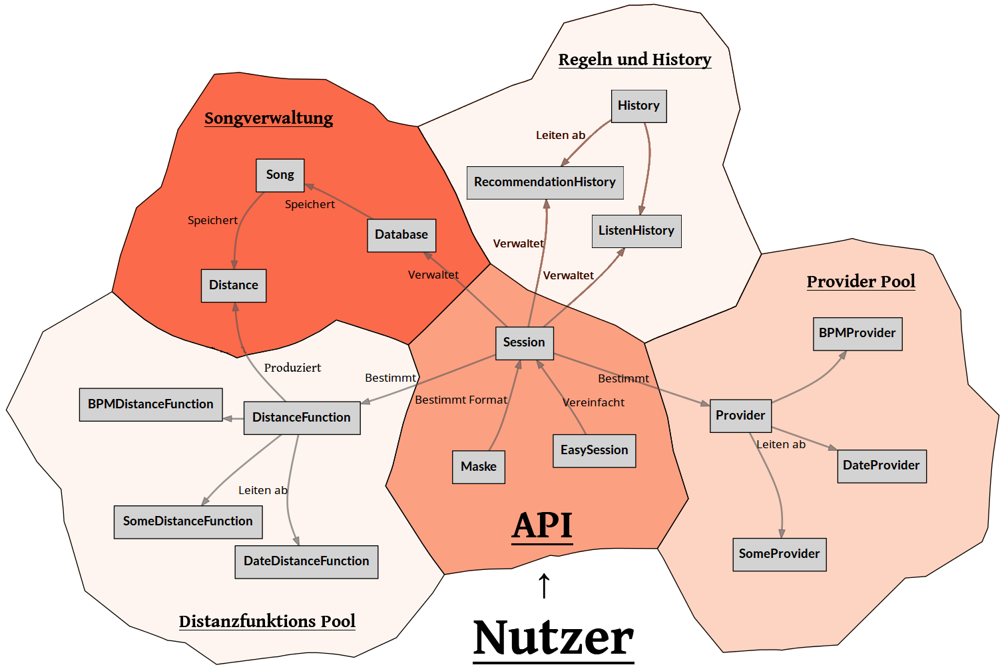

******
Design
******

.. epigraph::

    | *If the implementation is hard to explain, it's a bad idea.*
    | *If the implementation is easy to explain, it* may *be a good idea.*

    -- *Zen of Python*, ``import this``

Architektur
===========

:dropcaps:`Baukastenprinzip`

Algorithmik
===========

Die genaue Beschreibung der Algorithmik wird in der Bachelorarbeit detailliert
besprochen. Hier nur ein kurzer Überblick was mit welchem Ziel implementiert
wird.

Grundüberlegungen
-----------------

Um die Distanzen zu speichern wird bei vielen Datamining-Projekten eine
Distanzmatrix genutzt - also eine quadratische Dreiecksmatrix in der
die Distanzen von jedem Dokument zu jedem anderen gespeichert werden.

Da das System auch für eine sehr hohe Anzahl von Songs funktionieren soll 
schließt sich die Benutzung einer Distanzmatrix allerdings von alleine aus.
Nehmen wir an ein Benutzer möchte seine Musiksammlung mit 40.000 Liedern
importieren, so bräuchten wir soviele Felder in der Matrix:

.. math:: 

    \frac{(40.000^2 - 40.0000)}{2} = 799.980.000

Nimmt man für jedes Feld einen günstig geschätzten Speicherverbrauch von 4 Byte
an, so bräuchte man allein für die Distanzmatrix hier aufgerundet 3 Gigabyte
Hauptspeicher - was selbst für diesen günstig geschätzten Fall unakzeptabel
wäre. Auch eine Sparsematrix wäre hier kaum sinnvoll da in allen Fällen ja etwas
weniger als die Hälfte aller Felder befüllt ist.

Man muss also versuchen nur eine bestimmte Anzahl von Distanzen für einen Song
zu speichern - vorzugsweise eine Menge von Songs mit der kleinsten
:term:`Distanz`. Als geeignete Datenstruktur erscheint hier ein Graph - die
Knoten desselben sind die Songs und die Kanten dazwischen die Distanzen.

TODO: Erläuterung: kNN Graph

Graphenoperationen
------------------

Angenommen jeder :term:`Song` ist eine Mapping von Attributen zu Werten, so
können wir für jedes Attribut eine :term:`Distanzfunktion` definieren. Nach
einer bestimmten Gewichtung können wir dann die einzelnen Distanzen
zusammenrechnen und zu einer gemeinsamen :term:`Distanz` zusammenschmelzen.

Um mit unseren Graphen arbeiten zu können müssen wir einige Operationen auf ihm
definieren:

``rebuild``
~~~~~~~~~~~

Bevor der Graph benutzt werden kann muss er natürlich erstmal aufgebaut werden. 
Der naive Ansatz wäre dabei für jeden Song die Distanzen zu jedem anderen Song
zu berechnen - dies hätte einen Aufwand von :math:`O(n^2)` zur Folge. Dies ist
aus oben genannten Gründen ebenfalls kaum wünschenswert.

Deshalb kann die ``rebuild`` keinen *perfekten* Graph erzeugen sondern muss für
hinreichend große Datenmengen auf eine Approximation zurückgreifen. 

Nach dem Aufbau sollte ein ungerichteter Graph dabei herauskommen im dem
idealerweise jeder Knoten vom jedem anderen Knoten erreichbar ist - es sollten
also keine *Inseln* dabei entstehen. Es gibt keine maximale Anzahl von Nachbarn
die ein Song haben darf - lediglich einen *Richtwert*.

``add``
~~~~~~~

Füge einen einzelnen Song zu dem Graphen hinzu, verbinde ihn aber noch nicht.
Dies ist die bevorzugte Operation um viele Songs dem Graphen hinzuzufügen -
beispielsweise am Anfang - da das Verbinden später in einem ``rebuild``-Schritt
erledigt werden kann.

``insert``
~~~~~~~~~~

Fügen einen einzelnen Song zu dem Graphen hinzu und verbinde ihn. Suche dazu
erst eine passende Stelle in der er eingepasst wird.

``remove``
~~~~~~~~~~

Entferne einen einzelnen Song aus dem Graphen und versuche das entstandene
*Loch* zu flicken indem die Nachbarn des entfernte Songs untereinander
verkuppelt werden.

``modify``
~~~~~~~~~~

Manchmal ist es nötig das Attribut eines einzelnen Songs - wie beispielsweise
das stark vom Benutzer abhängige **Rating** - zu ändern. Dabei wird der Song
erst mittels ``remove`` entfernt, die Attribute werden angepasst und er wird
mittels ``insert`` wieder eingefügt. 

``fixing``
~~~~~~~~~~

Durch das Löschen und Hinzufügen von Songs können *Einbahnstraßen* im Graphen
entstehen. Durch dem nachgelagerten *fixing* Schritt werden diese, nach
bestimmten Regeln, entweder entfernt oder in bidirektionale Verbindungen
umgebaut.

Ausstellen von Empfehlungen
---------------------------

Das Ausstellen von Empfehlungen wird durch das Traversieren des Graphen
mittelseiner Breitensuche erledigt. Dabei wird der Ursprung durch ein
sogenannten :term:`Seedsong` bestimmt. Anschaulich wäre der Seedsong bei einer
Anfrage wie ,,10 ähnliche Songs zu *The Beatles - Yellow Submarine* `` eben
dieser Song. 

Aus der funktionalen Programmierung wurde dabei das Konzept der *Infinite
Iterators* übernommen: Anstatt eine bestimmte Anzahl von Empfehlungen als Liste
wird ein Versprechen herauzugeben die Empfehlungen genau dann zu berechnen wenn
sie gebraucht werden (*Layz Evaluation*). Dadurch ist auch die Zahl der
zu gebenden Empfehlungen variabel - was sehr nützlich beim Erstellen einer 
dynamischen Playlist ist.

Es können auch mehrere Seedsongs verwendet werden - dann werden die einzelnen
*Iteratoren* im Reißschlußverfahren verwebt.

Filtern von Empfehlungen
------------------------

Oft es nötig die gegebenen Empfehlungen noch zusätzlich zu filtern. Das hat den
simplen Grund das im Graphen einzelne Alben einzelne *Cluster* bilden - die
Lieder auf einem Album sind unter sich sehr ähnlich. Da man aber vermeiden
möchte dass zu einem Seed-Song ein Lied vom selben Album oder gar selben
Künstler empfohlen wird müssen diese beim Iterieren über den Graphen ausgesiebt
werden.

Dazu werden die zuletzt gegebenen Empfehlunge betrachtet - ist beispielsweise in
den letzten 5 Empfehlungen der gleiche Artist bereits vorhanden so wird die
Empefhlunge gesiebt. 

Lernen durch die History
------------------------

Nur eine bestimmte Anzahl von Regeln wird gespeichert - zuviele Regeln würden
*historische Altlasten* immer weiter mitschleppen und der aktuelle Geschmack des
Benutzers würde nicht widergespiegelt werden.

Integration von libmunin in die Umwelt
======================================

.. figure:: figs/integration.*
    :alt: Integrationsübersicht
    :width: 100%
    :align: center

    Wie fügt sich libmunin in seine Umgebung ein?

.. figure:: figs/munin_startup.*
    :alt: Allgemeine Benutzung
    :width: 75%
    :align: center

    Allgemeine Benutzung von libmunin

Periphere Komponenten
=====================

Jetzt wissen wir wie unsere interne Datenstruktur aussieht und wie diese sich in
die Umwelt einfügen muss. Wie also kann man die Schnittstellen zwischen beiden
bilden?  

- Musikdaten müssen importiert werden
- Verarbetung eines einzelnen Attributes
- ...

.. figure:: figs/arch.*
    :alt: Architekturübersicht.
    :width: 100%
    :align: center

    Grobe Übersicht über die Architektur.

Entwurf der Software
====================

Da wir jetzt wissen aus welchen Komponenten unsere Software besteht können wir uns
Gedanken darüber machen wie diese einzelnen Teile konkret aussehen.
Im folgenden werden die ,, *Hauptakteure* '' der Software vorgestellt:

Übersicht
---------

Unter :num:`fig-class-overview` findet sich eine grobe Übersicht der wichtigsten 
Klassen.

.. _fig-class-overview:

    Jeder Node ist eine Klasse in den jeweiligen Teilbereichen der Software.
    Provider und DistanceFunktion Unterklassen nur beispielhaft gezeigt.

Grobe Unterteilung
------------------

Wir schauen uns zuert die einzelnen *Regionen* der Software an, danach
widmen wir uns den einzelnen Komponenten.

Grob ist die Software in fünf unterschiedliche *Regionen* aufgeteilt.

1. API 
~~~~~~

Die API ist die Schnittstelle zum Benutzer hin. Der Nutzer kann mittels einer
``Session`` auf alle Funktionen von *libmunin* zugreifen. Dazu muss er beim
Instanzieren derselben eine ``Maske`` angeben die die Musikdatenbank beschreibt. 
Alternativ kann die ``EasySession`` genutzt werden die für viele Anwendungsfälle
ausreichen ist.

2. ``Provider`` Pool
~~~~~~~~~~~~~~~~~~~~

Hier werden alle 

In der Übersicht :num:`fig-class-overview` wurde aus übersichtlichkeitsgründen
exemplarisch nur drei ``Provider`` gezeigt

3. ``DistanceFunction`` Pool
~~~~~~~~~~~~~~~~~~~~~~~~~~~~

In der Übersicht :num:`fig-class-overview` wurde aus übersichtlichkeitsgründen
exemplarisch nur drei ``Provider`` gezeigt

4. Songverwaltung
~~~~~~~~~~~~~~~~~

Hier geschieht alles was mit dem Speichern und Vergleichen einzelner Songs zu
tun hat. Dies umfasst das Speichern der ``Songs`` in der ``Database`` sowie das 
Verwalten der Nachbarschafts ``Songs`` für jeden ``Song`` mit den dazugehörigen 
``Distance``.

Der oben erwähnte Graph entsteht durch die Verknüpfungen der Songs untereinander
und bildet keine eigenständige Klasse.

5. Regeln und History
~~~~~~~~~~~~~~~~~~~~~

Einzelne Komponenten
--------------------

Maske
~~~~~

- Beschreibung der Musikdatenbank die von außen reinkommt.
- Besteht aus einem Mapping, bei dem die keys den Namen eines Attributes
  festlegt das ein einzelner Song haben wird, das zugehörige Value legt
  den dafür zuständigen Provider, die zuständige Distanzfunktion und 
  wie stark dieses Attribut des Songs gewichtet werden soll.

Session
~~~~~~~

- API Entry für alle Funktionen
- Speichert songs ab
- Speichert die Maske

Song
~~~~

- Speichert nur values, keine keys.

Distance
~~~~~~~~

- Speichert alle Teildistanzen, statt einzelne weighted Distanz.
- Macht 'explanations' leicht.

Database
~~~~~~~~

History
~~~~~~~

RecommendationHistory 
""""""""""""""""""""""

ListenHistory
"""""""""""""

Provider
~~~~~~~~

DistanceFuntion
~~~~~~~~~~~~~~~

