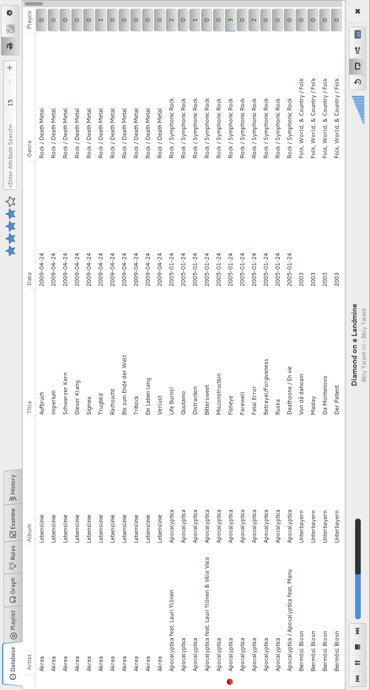
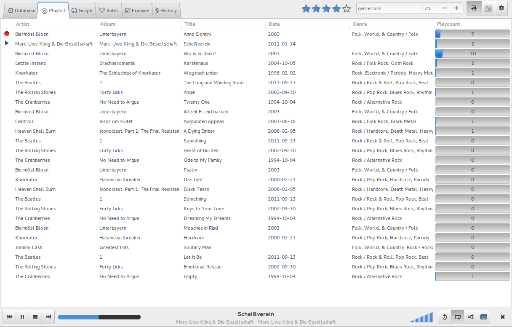
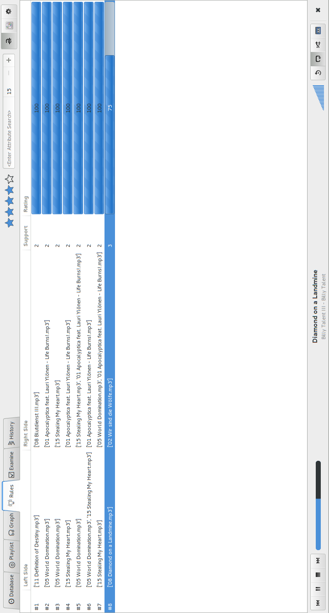
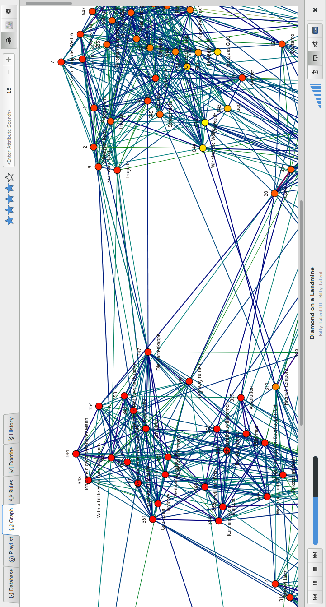
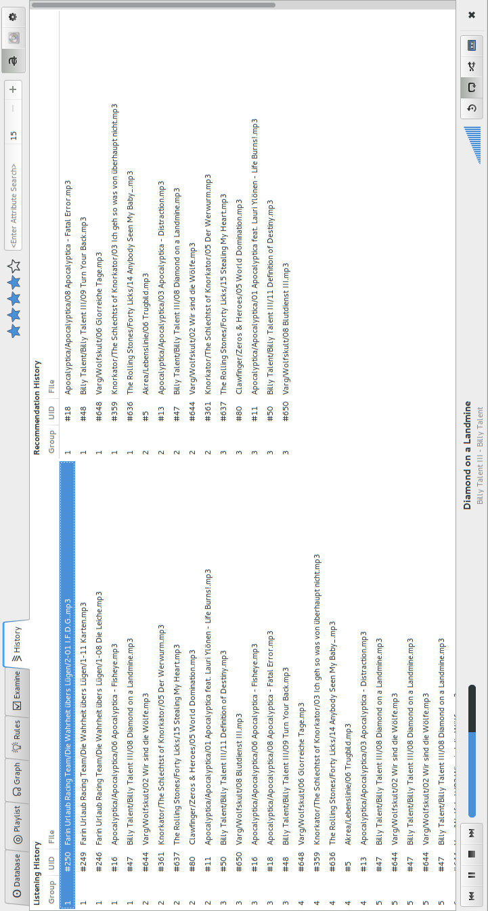
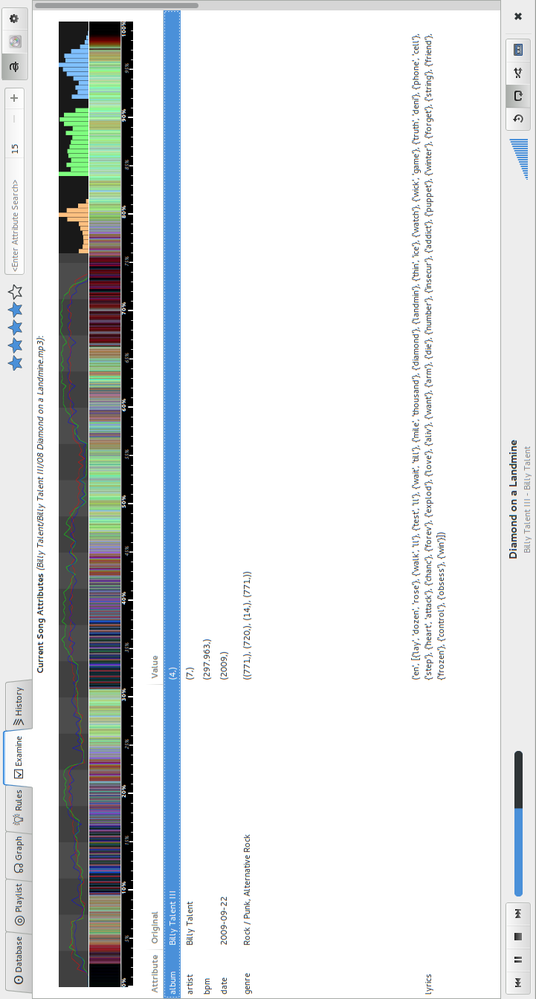

****
Test
****

.. epigraph:: 

   '' *These plus Antithese gleich Hysterese* '' 

   -- *Einfach Göttlich, Terry Pratchett*

Erfüllung der Anforderungen
===========================

Verifizierung
=============

Schauen ob das Programm dem Design entspricht

Validierung
===========

Schauen ob das Programm das Problem löst.

Demonanwendung als Debugger
===========================

Abseits der Library wurde eine auf dem freien Oberflächen-Framework GTK+-3.0
basierende GUI-Anwendung entwickelt.  Entsprechend :ref:`anf-demo` dient diese
nicht nur zum *Showoff*, sondern auch zur gezielten Fehlersuche.

Die Anwendung, die den ebenfalls nordischen Namen *Naglfar* erhielt,
implementiert einen MPD-Client. Beim Start ack

.. _fig-demo-overview:

.. figure:: figs/demo_overview.*
    :alt: Übersicht über die Demoanwendung
    :width: 100% 
    :align: center
    
    Übersicht über die Demonanwendung

Erklärung der Kontrollelemente in :num:`fig-demo-overview`.

Main
~~~~

1) Views

    #. *Database* :num:`fig-demo-database`
    #. *Playlist* :num:`fig-demo-playlist`

       Wie die *Database View*, zeigt aber lediglich die Songs an die empfohlen
       wurden. Sonst ist diese View Funktionsidentisch mit der *Database View*.

    #. *Graph* :num:`fig-demo-graph`

       Im *Graphen View* kann ein Plot von *libmunin's* Graphen begutachtet
       werden. Dies ist oft nützlich um nachvollziehen welche Empfehlungen warum
       gegeben wurden.

    #. *Rules* :num:`fig-demo-rules`

       In einer Liste werden alle bekannten :term:`Assoziationsregeln`
       angezeigt. Dabei wird neben beiden Seiten der Regel auch der Supportcount
       und das Rating der Regel angezeigt.

    #. *Examine* :num:`fig-demo-examine`

       Hier werden alle Attribute des momentan spielenden Songs angezeigt. 
       Es wird die von *libmunin* normalisierte Form angezeigt, also auch, falls
       verfügbar, der Originalwert.

       Zudem wird die *moodbar* oben im Fenster geplottet.

    #. *History* :num:`fig-demo-history`

       Neben einer chronologischen Auflistung aller Songs die in letzter Zeit
       gehört wurden (Begrenzung auf 1000 Stück) werden hier auch die zuletzt 
       ausgestellten Empfehlungen (Begrenzung auf 10 Stück) angezeigt.

       Letzteres ist für das Debugging der Filter-Funktion nützlich.

2) Seed Song
3) Current Song
4) Playlist

Controls
~~~~~~~~

5) Recom Count
6) Filter
7) Max. listen
8) Query Entry
9) Rating

Media Controls
~~~~~~~~~~~~~~

Typische Bedienelemente eines Audioplayers.

10) Playcount
11) Volume Bar
12) Title Label
13) Mode buttons

    Umschalten zwischen *Random*, *Single*, *Repeat* und *Consume*.

14) Seekbar

    Ermöglicht das wahlfreie  

15) Playbuttons

.. _fig-demo-database:

    Die Datenbank Ansicht - Anzeige aller Songs.

.. _fig-demo-playlist:

    Die aktuelle Playlist, bestehend aus den Empfehlungen.

.. _fig-demo-rules:

    Die momentan bekannten Regeln

.. _fig-demo-graph:

    Der Graph der hinter den Empfehlungen steckt wird hier geplottet.

.. _fig-demo-history:

    History-Ansicht, die zuletzt gehörten und empfohlenen Songs.

.. _fig-demo-examine:

    Die ,,Examine'' Page - Die Attribute des aktuellen Songs werden angezeigt.
