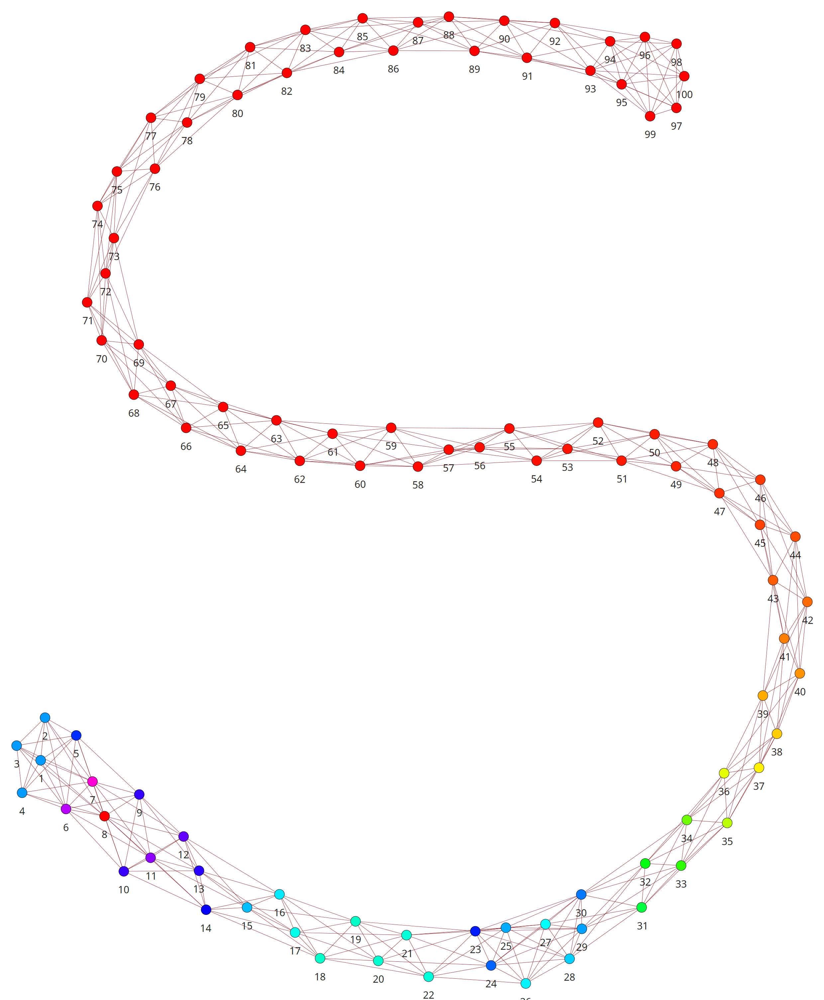
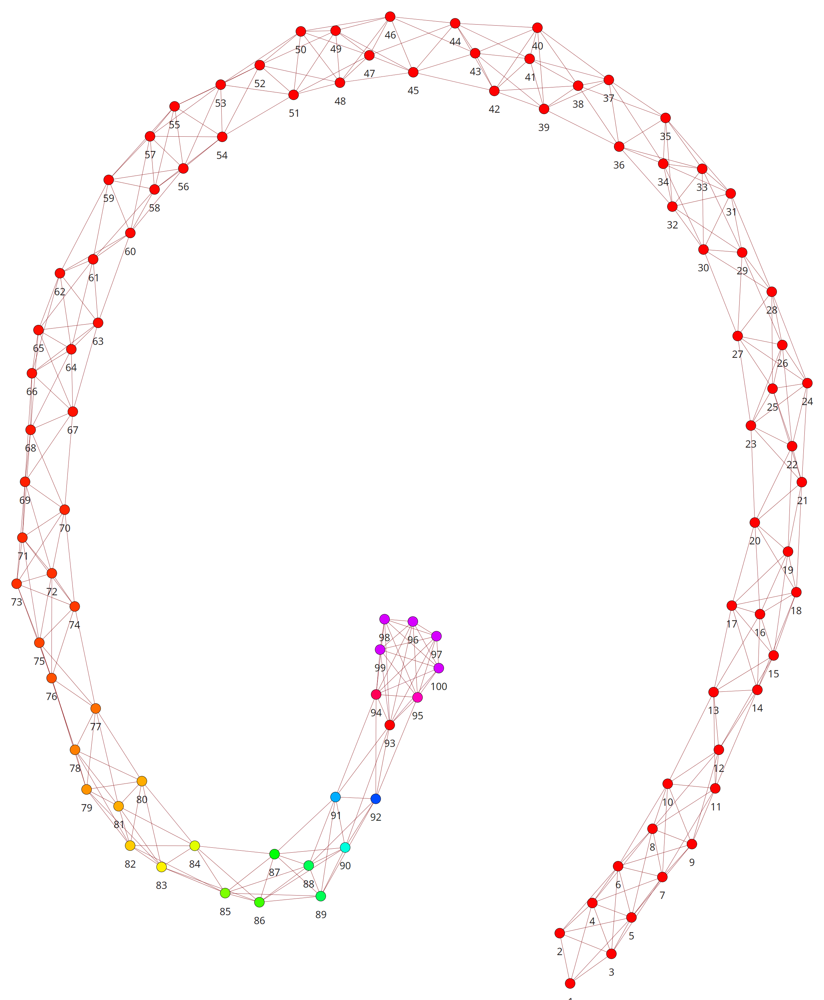
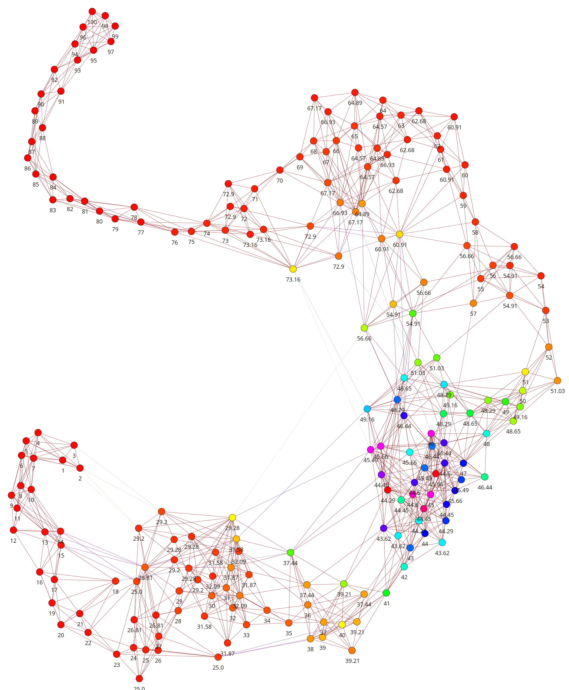
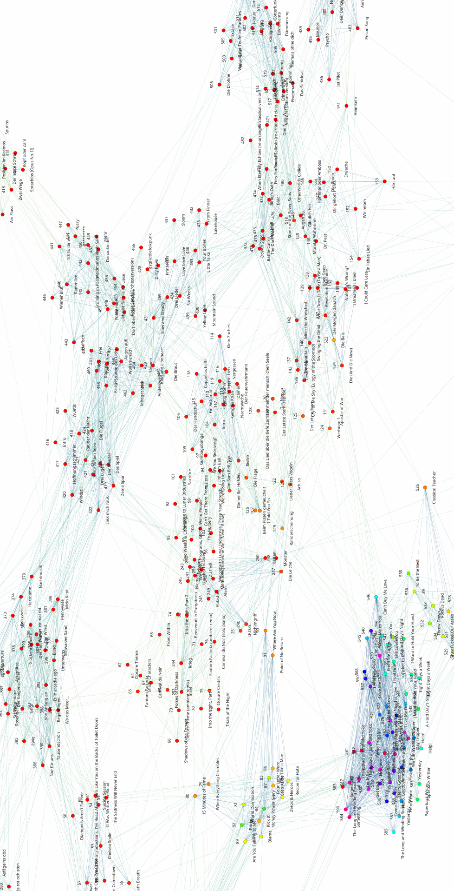

.. raw:: latex

   \appendix

Bilder des Song--Graphen
========================

Allgemeine Hinweise
-------------------

Folgende visuelle Aspekte sind mit Informationen besetzt:

- *Kantenfarbe:* Rote Farbe indiziert eine hohe Distanz. Grün eine mittlere
  Distanz (etwa :math:`0.5`). Blau bis violett eine gute bis sehr gute
  (:math:`0.1` bis :math:`0.0`). Rote Kanten sieht man selten, da in den meisten
  Fällen immer ein guter Nachbar gefunden werden kann.
- *Kantendicke:* Zur optischen Untermalung variiert die Dicke der Kanten je nach
  Distanz. Hohe Distanzen bekommen eine dünnere Kante.
- *Knotenfarbe:* Zeigt grob die Zentralität des Knoten an. Bietet lediglich eine
  optische Navigationshilfe um auf Cluster hinzuweisen.
- Der visuelle Abstand zwischen zwei Knoten hat *keine* Aussagekraft, auch wenn
  ähnliche Knoten oft nah beieinander sind.

Die Abbildungen :num:`fig-graph-linear-basic` bis :num:`fig-graph-linear-stupid`
und :num:`fig-graph-euler-basic` bis :num:`fig-graph-euler-stupid` zeigen den
Aufbau des Graphen anhand von linearen und pseudozufälligen generierten
Testdaten mit jeweils 100, beziehungsweise 200 Knoten.
Abbildung :num:`fig-graph-full` zeigt einen realen, praktischen Graphen
mittlerer Größe mit 666 Knoten. Die Liedtitel wurden jeweils an die Knoten
geschrieben.

Bei den linearen Testdaten werden die Zahlen von 1 bis 100 aufsteigend jedem
neuen Knoten gegeben. Das Resultat sollte im optimalen Fall daher eine Kette von
Knoten zeigen deren Knotennummer von einem Ende zum anderen immer weiter steigt.
Die pseudozufälligen Testdaten mischen die erwähnten linearen Daten mit
zusätzlichen zufällig erscheineden Daten gleicher Anzahl. Diese sind zum größten
Teil auf den Bereich 25--75 aufgeteilt. Es sollte ein Graph entstehen der
ähnliche linear ist, aber in der Mitte eine *,,Verdichtung"* aufweist.
Beides sind Testdaten, die häufig zum Testen von *libmunin* genutzt worden, da
sie spezielle Extremfälle gut testen.

Plotting der Graphen
--------------------

Alle Graphen in diesem Teil des Anhangs sind mithilfe des freien Python
Graphenframeworks ``igraph`` :cite:`igraph` entstanden. Als Zeichenbibliothek
nutzt ``igraph`` die freie 2D Zeichenbibliothek ``cairo`` :cite:`cairo`.  Der
verwendete Layouting--Algorithmus ist *,,Fruchtermann--Reingold"*.

.. ----------------

.. raw:: latex

    \newpage

.. ----------------

.. subfigstart::

.. _fig-graph-linear-basic:

.. figure:: figs/graph_linear_basic.png
    :alt: Nur mit ``sliding_window`` behandelte Eingabe.
    :width: 100%
    :align: center
    
    Nur mit ``sliding_window`` behandelte Eingabe.

.. _fig-graph-linear-all:

.. figure:: figs/graph_linear_all.png
    :alt: Zusätzlich mit dem ``centering_window`` und ``anti_centering_window`` behandelt.
    :width: 100%
    :align: center
    
    Zusätzlich mit dem ``centering_window`` und ``anti_centering_window`` behandelt.

.. _fig-graph-linear-refine:

    
    Zusätzliche Verfeinerungsphase.

.. _fig-graph-linear-stupid:

    
    Mittels ``rebuild_stupid`` generierter Vergleichsgraph.

.. subfigend::
    :width: 0.475
    :alt: Abbildungen des linearen Testgraphen
    :label: fig-graph-linear
 
    Verschiedene Stufen beim Aufbau eines Graphen aus linearen Testdaten. Die
    Testdaten bestehen aus den Integern 1 bis 100.  Erwartet wird dabei als
    Ausgabe eine lineare Kette von Knoten, wobei jeder Knoten ca. 7 Nachbarn
    haben sollte.

.. ----------------

.. _fig-graph-euler-basic:

   Graph aus Zufallsdaten nach erster Basisiteration.

.. _fig-graph-euler-all:

.. figure:: figs/graph_euler_all.png
   :width: 100%
   :alt: Graph aus Zufallsdaten nach allen Basisiterationen.
   :align: center

   Graph aus Zufallsdaten nach allen Basisiterationen.

.. _fig-graph-euler-refine:

.. figure:: figs/graph_euler_refine.png
   :width: 100%
   :alt: Graph aus Zufallsdaten nach einem Verfeinerungsschritt.
   :align: center

   Graph aus Zufallsdaten nach einem Verfeinerungsschritt.
   
.. _fig-graph-euler-stupid:

.. figure:: figs/graph_euler_stupid.png
   :width: 100%
   :alt: Der ,,korrekte“, mittels rebuild_stupid erstellte Graph.
   :align: center

   Der ,,korrekte“, mittels rebuild_stupid erstellte Graph.

.. ----------------

.. _fig-graph-full:

   Auschnitt aus dem vollständigen Graph, der hinter den Empfehlungen der
   Demonanwendungen steckt. Auf der beiliegenden CD ist der vollständige Graph
   in A0 Größe enthalten.

.. _genre-graph-vis:

Bilder des Genregraphen
=======================

Der Vollständigkeit halber wird hier auch eine Visualisierung des Genre--Graphen
gezeigt. Daraus kann man zwar keine *,,Neuen Erkenntnisse"* ziehen, doch kann er
in der weniger detaillierten Version zumindest als Überblick über die einzelnen
Genres dienen. Die detailliertere Version führt einen vor Auge wieviel einzelne
Musikgenres mit der Zeit entstanden sind.  Die Graphen wurden mit dem freien
Graphenvisualisierungspaket ``Graphviz`` :cite:`graphviz` generiert. Das
Vorgehen soll hier dokumentiert werden.

Folgendes erstellt die ``Graphviz``--Eingabedatei.

.. code-block:: bash
  
   $ pwd 
   ~/dev/libmunin
   $ export PYTHONPATH=$PYTHONPATH:.
   $ python "munin/provider/genre.py" --cli --plot 0.0  # Detailstufe: 0.0 = max.
   $ head -n8 "/tmp/genre.graph"
     graph {
         overlap=prism3000; overlap_scale=-7; splines=curved
         edge [color="#666666"]
         node [shape="none", style="rounded, filled", fillcolor="..."]
         "music" -- "rock"
         "music" -- "pop"
         // ...
     }

Daraus kann dann mittels ``Graphviz``--Bordmitteln den Graphen in verschiedenen
Formaten rendern. Hier die Prozedur für ein *PDF*:

.. code-block:: bash

   $ sfdp /tmp/genre.graph           | \  # Layoutting der einzelnen Nodes.
     gvmap -e                        | \  # Einzeichnen der "Länderflächen".
     neato                             \  # Eigentliches Zeichnen.
        -Ecolor="#55555555"            \  # Farbe der Kanten.
        -Nfontname="TeX Gyre Adventor" \  # Font für die Nodelabels.
        -Tpdf                          \  # Ausgabeformat.
     > graph.pdf                          # Ausgabedatei.
   $ pdf-viewer graph.pdf                 # Fertiges Bild.

*Anmerkung:* Die einzelnen *,,Länder"* im Graphen dienen lediglich der optischen
Trennung. Die Farbsättigung der Knoten und die verwendete Größe der Schrift
weist auf die Menge der Kinder hin, die der Knoten hat. Je weiter weg der Knoten
vom Wurzelknoten entfernt ist, desto oranger wird er (von rot beginnend).

.. raw:: latex

   \newpage

.. figure:: figs/genre_graph_big.*
   :width: 100%
   :alt: Übersicht über alle 1876 Musikgenres. (Detailstufe: 0.0)
   :align: center

   Übersicht über alle 1876 Musikgenres. (Detailstufe: 0.0)

.. figure:: figs/genre_graph_mid.*
   :width: 100%
   :alt: Übersicht über die gebräuchlichsten Musikgenres. (Detailstufe: 0.1)
   :align: center

   Übersicht über die gebräuchlichsten Musikgenres. (Detailstufe: 0.1)

.. figure:: figs/genre_graph_min.*
   :width: 100%
   :alt: Übersicht über die wichtisten Musikgenres. (Detailstufe: 0.5)
   :align: center

   Übersicht über die wichtisten Musikgenres. (Detailstufe: 0.5)

Medien
======

Der Vollständigkeit halber werden hier noch die für *libmunin* erstellten Logos
abgedruckt. Abbildung :num:`fig-logo` dient dabei eher als Logo für eigene
Zwecke, während das *Emblem* unter :num:`fig-logo-emblem` von
Anwendungsentwicklern genutzt werden kann, um auf den Gebrauch von *libmunin* in
ihren Anwendungen hinzuweisen.

Die Grafiken wurde mit dem freien Vektorzeichenprogramm ``Inkscape``
:cite:`inkscape` erstellt und können auf der API--Dokumentation runtergeladen
werden: :cite:`logos`. 

.. only:: latex or text

    Dieses Dokument existiert neben dem vorliegenden *PDF* auch, wie schon bei der
    Projektarbeit, als HTML--Version: :cite:`html_variant`.

.. subfigstart::

.. _fig-logo:

.. figure:: figs/logo.*
   :width: 40%
   :alt: Das 
   :align: center

   Logo im quadratischen Format.

.. _fig-logo-emblem:

.. figure:: figs/logo_emblem.*
   :width: 80%
   :alt: Das
   :align: center

   Logo im breiten Format. 
 
.. subfigend::
    :width: 1.0
    :alt: Mögliche logos für libmunin
    :label: fig-logos
 
    Logos für libmunin. Der dargestellte Vogel stellt Odin's Rabe ,,Munin“ dar.
