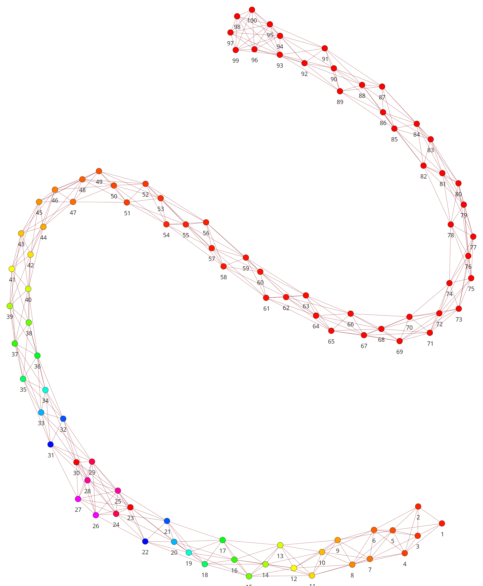
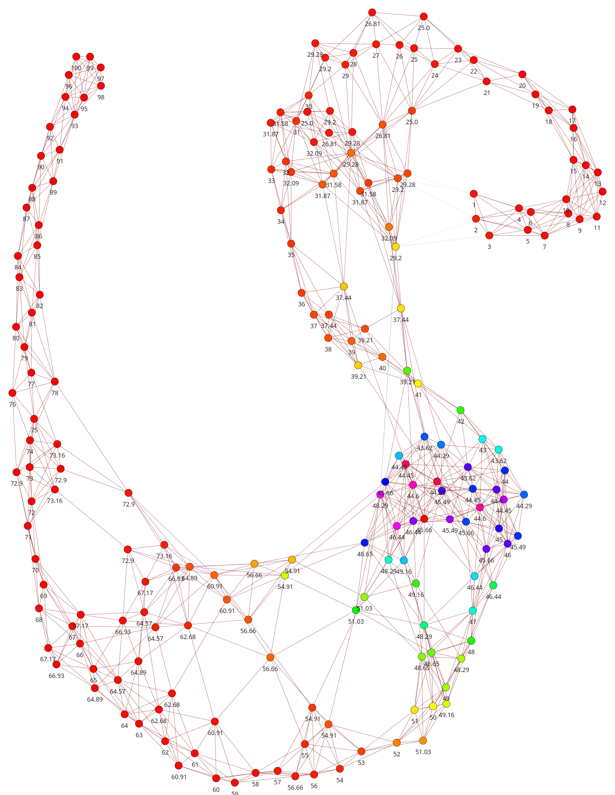
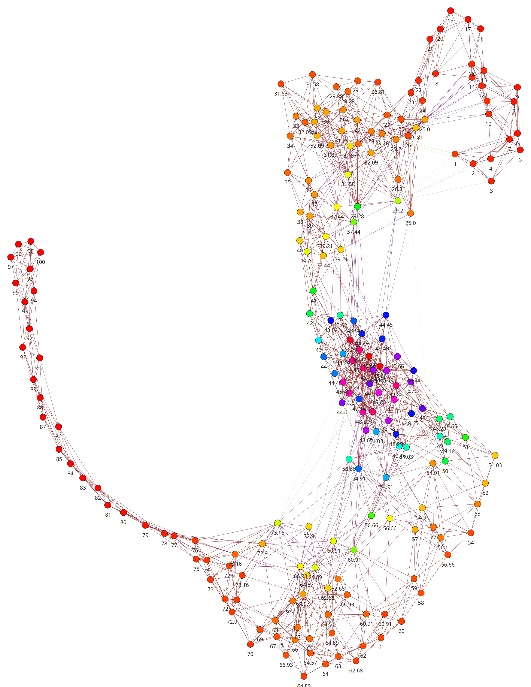

.. raw:: latex

   \appendix

Graphenbilder
=============

Beschreibung

.. raw:: latex

    \newpage

.. subfigstart::

.. _fig-graph-linear-basic:

    
    Nur mit ``sliding_window`` behandelte Eingabe.

.. _fig-graph-linear-all:

.. figure:: figs/graph_linear_all.png
    :alt: all
    :width: 100%
    :align: center
    
    Zusätzlich mit ``centering_window`` und ``anti_centering_window`` behandelt.

.. _fig-graph-linear-refine:

.. figure:: figs/graph_linear_refine.png
    :alt: refine
    :width: 100%
    :align: center
    
    Zusätzliche Verfeinerungsphase.

.. _fig-graph-linear-stupid:

    
    Mittels ``rebuild_stupid`` generierter Vergleichsgraph.

.. subfigend::
    :width: 0.475
    :alt: Abbildungen des linearen Testgraphen
    :label: fig-graph-linear
 
    Verschiedene Stufen beim Aufbau eines Graphen aus linearen Testdaten. Die
    Testdaten bestehen aus den Integern 1 bis 100.  Erwartet wird dabei als
    Ausgabe eine lineare Kette von Knoten, wobei jeder Knoten ca. 7 Nachbarn
    haben sollte.

   stuff.

   stuff.

   stuff.
   
.. figure:: figs/graph_euler_stupid.png
   :width: 100%
   :alt: Basic
   :align: center

   stuff.

.. figure:: figs/full_graph.png
   :width: 100%
   :alt: Basic
   :align: center

   stuff.

.. _genre-graph-vis:

Bilder des Genregraphen
=======================

Beschreibung.

.. raw:: latex

   \newpage

.. figure:: figs/genre_graph_big.*
   :width: 100%
   :alt: Basic
   :align: center

   stuff.

.. figure:: figs/genre_graph_mid.*
   :width: 100%
   :alt: Basic
   :align: center

   stuff.

.. figure:: figs/genre_graph_min.*
   :width: 100%
   :alt: Basic
   :align: center

   stuff.
